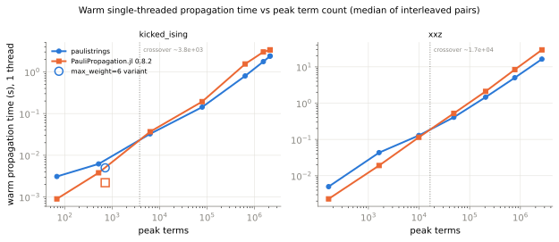
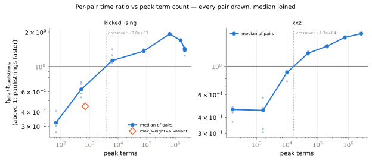
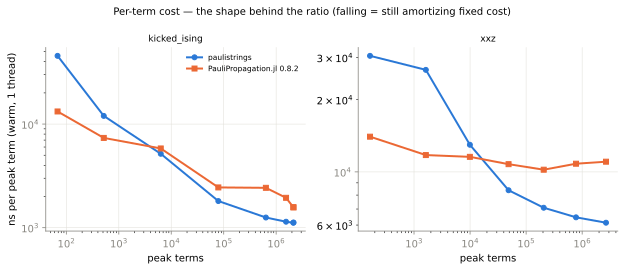
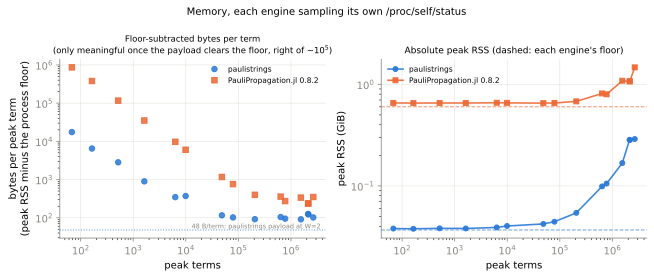

# Head-to-head: `paulistrings` vs PauliPropagation.jl

Single-threaded, core-versus-core, on parity-gated configurations, under an interleaved-pair protocol.

> ## ⚠ PARTIAL STUDY — stopped deliberately, mid-run
>
> Two of five planned sections completed. The run was cancelled on purpose: the completed curves exposed a
> large-term-count effect (below) worth investigating in the engine before spending another hour measuring, so
> effort was redirected into an optimization investigation of that regime.
>
> | section | status |
> |---|---|
> | kicked-Ising curve (9 configurations) | ✅ **complete**, 5 pairs each |
> | XXZ curve (7 of 8 configurations) | ✅ **complete** for those 7, 5 pairs each |
> | XXZ `min_abs_coeff = 1e-9` (8.47 M terms) | ⛔ cancelled mid-pairs — reconnaissance value only, see below |
> | SU(4) brickwork curve | ⛔ **not run** |
> | Time to fixed accuracy (3 references) | ⛔ **not run** |
> | Thread scaling (1→32 threads) | ⛔ **not run** |
>
> Nothing here is projected, interpolated across the gap, or padded. The 16 configurations reported each have
> their full 5-pair set; the cancelled one is excluded from every number, curve and verdict.
>
> Because the driver accumulates its summary in memory and writes it once at the end, the structured record was
> rebuilt from `run.log` (which is flushed line by line) by
> `benchmarks/python/jl_performance_recover.py`. That tool *imports* the driver's protocol math rather than
> reimplementing it, and refuses to write if a recomputed median or verdict disagrees with what the driver
> logged. See "Provenance of the numbers" for the two fields the log does not carry.

Driver: `benchmarks/python/bench_jl_performance.py`. Figures: `benchmarks/python/jl_performance_figures.py`.
Data: `results.json` (one record per configuration per engine, the suite's flat-array convention) and
`summary.json` (per-pair ratios, crossovers, parity evidence). `run.log` is the full transcript. CI gate on the
protocol logic: `python/paulistrings/tests/test_jl_performance_protocol.py`.

## Headline findings

1. **Both engines win, in different regimes, and the boundary is sharp.** Below the crossover
   PauliPropagation.jl is 1.6–3.1× faster; above it `paulistrings` is up to 1.93× faster. The crossover sits at
   **~3.8 × 10³ peak terms** for kicked-Ising and **~1.7 × 10⁴** for XXZ — a 4.4× spread across two workloads,
   which is the main reason not to quote a single global crossover.
2. **All 80 pairs agreed in sign. There are no indistinguishable zones anywhere in this data.** 16
   configurations × 5 pairs, every configuration unanimous on which engine was faster. Every reported ratio is
   therefore a real difference under `PROFILING.md`'s acceptance rule, not a noise artifact.
3. **Our advantage is non-monotone on kicked-Ising: it peaks at 1.93× near 6.4 × 10⁵ terms and falls back to
   1.39× at 2.1 × 10⁶.** "We get further ahead the bigger it gets" is *not* what the data says. This decay is
   the motivation for the follow-up campaign.
4. **The decay is Julia getting faster, not us getting slower.** Over that same range our cost per term falls
   1252 → 1120 ns (−11%, still improving) while Julia's falls 2424 → 1567 ns (−35%). Nothing on our side
   degrades.
5. **And it is a saturation effect, not a large-`m` effect.** On XXZ, which is nowhere near saturation at
   2.7 × 10⁶ terms, the ratio rises *monotonically* to 1.80× and Julia's per-term cost is flat-to-rising. See
   "Hypothesis" below.
6. **Memory: we use ~2.3–2.9× less per term and ~16× less fixed.** Our process floor is 37 MB against Julia's
   0.60 GiB; above 6 × 10⁵ terms we hold 91–125 B/term against Julia's 237–357 B/term.
7. **Consistency with benchmark D.** At D's own configuration and term count (XXZ n=100, `Jz=0.5`, 206 035
   terms) this study measures ratio 1.438 where D measured 1.590 — an 11% gap between two independent
   campaigns, comfortably inside this host's noise floor, with identical direction.

## Why this exists when three suites already timed both engines

Benchmarks C, D and E each produced cross-engine timings as a side effect of asking a different question, and
they disagreed about which engine is faster — D found PauliPropagation.jl at 0.24–0.31× our time below 10⁴
terms but us 1.45–1.59× faster at 3×10⁴–2×10⁵, while E found the two indistinguishable at 381k terms. Those are
not contradictions. They are three samples of a curve that crosses, taken at different points on it, with
single-shot timings whose noise floor (±5–8% single-threaded on this host) is comparable to some of the
differences being quoted.

This study asks only the head-to-head question, sweeps the term count deliberately rather than incidentally,
and uses the one protocol `benchmarks/PROFILING.md` says can resolve differences near that noise floor:
**interleaved pairs accepted on direction consistency, never a difference of two independently-noisy means.**

## The ratio convention, fixed once

**`ratio = t_julia / t_paulistrings`** everywhere — in `results.json` (`ratio_jl_over_rust`), in the figures,
and in every table below:

| ratio | meaning |
|---|---|
| `> 1` | **`paulistrings` is faster** (Julia spends more time) |
| `< 1` | **PauliPropagation.jl is faster** |
| `= 1` | the crossover |

One number line, one direction, no per-sentence convention flips. Benchmark D's numbers quoted above are
already in this convention.

## Protocol

Documented here and enforced in code, not merely described.

### 1. One task file per configuration drives both engines

Each configuration is a schema-v1 task JSON (frozen in `benchmarks/julia/README.md`). Julia reads it through
`benchmarks/julia/runner.jl`; this engine reads it through `paulistrings.interop.load_task`. Neither side
rebuilds the circuit from a private description, so "both engines ran the same circuit" is a property of the
file rather than of two code paths agreeing. The task files are kept under `tasks/`.

The workload gate lists mirror `examples/common/circuits.py` gate for gate. That mirroring is verified, not
asserted: rebuilt through `interop.circuit_from_json`, all three reproduce the term counts and expectations
benchmarks C, D and E committed, bit for bit —

| workload | rebuilt | benchmark C/D/E committed |
|---|---|---|
| kicked-Ising 127q, 5 steps, 2⁻¹⁰ | 72 352 terms, `0.23928770151774437` | same |
| XXZ n=100, 6 steps, 1e-4 | 9 918 terms, `0.026769547577935437` | same |
| SU(4) n=36, depth 6, 1e-3 | 84 836 terms, `-0.0030947264746490136` | same |

`test_jl_performance_protocol.py` keeps the mirrors pinned, so a change to `circuits.py` that the mirror does
not follow fails CI instead of silently comparing two different circuits.

### 2. Per-layer term-count parity gates every timed configuration

Before any pair runs, both engines propagate once, untimed, with per-gate term counts collected — Julia via
`@countpaulis`, this engine via its `layer {k}/{n}` DEBUG records — and **every** per-layer count must match,
not just the final one. Counts are compared in application order on both sides, which for
`direction="heisenberg"` means both lists run backwards through the task file and line up index by index
(`benchmarks/julia/README.md` §P5).

A mismatch raises, the configuration is recorded as disqualified, and **no timing for it is reported**. This is
not downgradeable to a warning: a term-count divergence means the two engines did different amounts of work, so
their runtimes are not comparable at all.

**Result: parity held at every one of the 16 configurations** — all 1355 layers identical on every kicked-Ising
configuration, all 1782 on every XXZ one, with expectations agreeing to ≤ 8.3e-17 (kicked-Ising) and ≤ 2.6e-16
(XXZ) against a 1e-9 bar. No configuration was disqualified.

### 3. The truncation boundary is made identical, by moving a threshold and nothing else

The engines disagree on exactly one case (`benchmarks/julia/README.md` §P3): this engine drops `|c| <= eps`
(inclusive), PauliPropagation.jl drops `|c| < eps` (strict), so Julia *keeps* a coefficient exactly equal to the
cutoff and this engine drops it. Truncation runs after every gate, so one boundary hit changes term counts for
the whole remaining circuit — it is not a rounding detail.

The Julia task therefore carries `nextafter(eps, +inf)`. No float lies strictly between `eps` and its successor,
so Julia's `|c| < eps'` **is** this engine's `|c| <= eps`, bit for bit. The threshold moves by one ulp; no
coefficient is touched anywhere. This is benchmark C's method, reused rather than reinvented, and it is applied
unconditionally — it is the exactly-right transformation for dyadic and non-dyadic cutoffs alike, and making it
unconditional removes a branch that could silently stop being taken.

Every configuration records whether its cutoff was dyadic, i.e. whether the mitigation was *load-bearing*. The
split is clean and deliberate: **all nine kicked-Ising cutoffs (2⁻⁴ … 2⁻¹⁸) are exact powers of two**, at a
Clifford `theta_zz = -pi/2` where coefficients are exact dyadics too — precisely the case where a coefficient
can land on the threshold bit-exactly. **All seven XXZ cutoffs are powers of ten**, where the boundary event is
measure-zero, so XXZ is the control: if the mitigation were subtly wrong, the two workloads would disagree about
parity, and they do not. `min_abs_coeff = 0` is banned outright — Julia keeps exact zeros and this engine's
merge drops them (§P9).

(A note on the recovered data: `run.log` prints cutoffs to four significant figures, which is enough to destroy
the very property `is_dyadic` tests — `2**-6` round-trips as `0.01562`. The recovery tool therefore snaps each
logged cutoff back to the workload's exactly-declared value and hard-errors if one matches nothing within 0.1%.
The first recovery pass mislabelled eight of nine kicked-Ising cutoffs as non-dyadic before this was fixed.)

### 4. Warm in-process timing, one process per leg, construction excluded

Both engines propagate once untimed and then time one propagation **in the same process**, so no reported number
contains Julia's JIT or a cold cache. Input construction, contraction, oracles and progress logging are outside
the timed region on both sides. Only propagation is compared: this engine's `propagation_time_s` against
Julia's `wall_warm_s`.

Each leg is its own process. That is deliberate on both counts — it gives every leg a clean per-process `VmHWM`
(a process-lifetime high-water mark inherits any earlier run's peak), and it makes the two engines symmetric,
since Julia has no choice but one process per invocation. The cost is that each Julia leg also pays an untimed
cold propagation; that is the protocol's price and it is not reported as anything.

`RAYON_NUM_THREADS=1` is exported before the interpreter starts — Rayon builds its global pool once, at the
first propagate, and never resizes it — and the driver refuses to start without it. Julia gets `-t1`.
`RUST_LOG` is unset in every leg.

### 5. Interleaved pairs, abba, accepted on direction consistency

Each configuration ran **5 pairs**. The within-pair order alternates — this engine first on even pairs, Julia
first on odd, giving `ab | ba | ab | ba | ab` — so a monotone drift in machine state cannot masquerade as a
consistent win for whichever engine always ran second (`PROFILING.md`'s `--order abba`). Legs ran strictly
sequentially on a box reserved for the study: never two engines at once, never alongside a build.

**Acceptance rule.** Every pair must agree on which engine was faster. If they do, the difference is real and
the **median ratio is its size**. If any pair disagrees in sign, the verdict is **`indistinguishable`** — not a
small win, not a trend, not something to average over. With a handful of pairs there is nothing statistically
meaningful to compute and none is computed; there are no p-values here.

**All 16 configurations were unanimous.** No indistinguishable zones arose, so no band is shaded in the figures.

### 6. Memory: each engine samples its own process

Both engines read their own `/proc/self/status` — `VmRSS` for the fixed floor, `VmHWM` for the peak. Julia's
sampling was added to `runner.jl` for this study (it emits a `memory` block, read before the untimed
`@countpaulis` pass so that pass cannot inflate the peak).

A driver-side `getrusage(RUSAGE_CHILDREN)` is **never** used: it is a running maximum over every child the
process has reaped, so a sibling engine's multi-gigabyte peak leaks into the other's number. Benchmark C hit
exactly this — the same 1925-term Julia task read 3.68 GiB by `getrusage` and 0.66 GiB by direct sampling.

Per-term figures subtract each engine's own floor and divide the remainder by the term count. Both floors are
far larger than a small run's payload, so a per-term figure is only meaningful once the payload clears the floor
(right of roughly 10⁵ terms); both the raw peak and the floor-subtracted figure are reported.

## Workloads

Two of the three planned workloads ran. All configurations Heisenberg, one gate per channel, single-threaded,
contracted against a state both engines can express.

| key | circuit | channels | observable / state | knob swept | status |
|---|---|---|---|---|---|
| `kicked_ising` | kicked-Ising on the 127-qubit Eagle heavy-hex map, 5 Trotter steps, `theta_h = 5pi/16`, `theta_zz = -pi/2` | 1355 = 5 × (127 `rx` + 144 `ZZ`) | `Z_62`, `z+` | `min_abs_coeff` 2⁻⁴…2⁻¹⁸ + one `max_weight=6` point | ✅ 9 configs |
| `xxz` | open XXZ chain, n=100, `Jz=0.5`, `dt=0.1`, 6 Trotter steps | 1782 = 6 × 3 × 99 | `Z_50`, domain wall `0⁵⁰1⁵⁰` | `min_abs_coeff` 1e-2…1e-8 | ✅ 7 configs |
| `su4` | Haar-random SU(4) brickwork, n=36, depth 6, seed 20260831 | 105 | `Z_18`, `z+` | `min_abs_coeff` 1e-2…1e-4 | ⛔ not run |

`kicked_ising` exercises native `pauli_rotation` on both engines (Julia's `PauliRotation`, its fast path — not a
transfer map). `xxz` is rotations only but with three generator types per bond and non-Clifford angles. `su4`
would have exercised the **matrix-gate** path (`unitary_2q` here, Julia's dense-PTM `TransferMapGate`); that
comparison remains unmeasured, and it is the one most likely to differ from the two reported here, since it
stresses different machinery on both sides.

The domain-wall state for XXZ is a computational basis state, which is what Julia can contract
(`overlapwithcomputational`); `|0…0⟩` is an eigenstate and `|+…+⟩` gives zero by symmetry, so both are vacuous.

## Results

### Crossover per workload

| workload | crossover (peak terms) | bracketed by | indistinguishable zone | configs | pairs |
|---|---|---|---|---|---|
| `kicked_ising` | **≈ 3.79 × 10³** | 517 terms @ 0.629 → 6 311 terms @ 1.126 | none — every configuration unanimous | 8 on the sweep (+1 variant) | 5 each |
| `xxz` | **≈ 1.65 × 10⁴** | 9 918 terms @ 0.895 → 48 599 terms @ 1.264 | none — every configuration unanimous | 7 | 5 each |

Interpolated linearly in `log10(ratio)` against `log10(peak terms)`, solved for `ratio = 1`. The `max_weight`
configuration is deliberately excluded from bracketing: a crossover is only meaningful along a
single-parameter family, and mixing two knobs on one axis can manufacture a bracket the sweep does not have.
(The driver logged 4.74 × 10³ for kicked-Ising during the run because it had not yet made that exclusion; the
committed value is the corrected one, and the driver was fixed in the same change.)

### Time vs term count



**kicked-Ising, 127 qubits, 5 Trotter steps, `theta_h = 5pi/16`, 1355 channels**

| `min_abs_coeff` | final terms | peak terms | rust s | jl s | median ratio | pairs agree | faster |
|---|---|---|---|---|---|---|---|
| 2⁻⁴ = 0.0625 | 7 | 68 | 0.0031 | 0.0009 | **0.323** | 5/5 | Julia |
| 2⁻⁶ = 0.01562 | 408 | 517 | 0.0062 | 0.0038 | **0.629** | 5/5 | Julia |
| 2⁻⁸ = 0.003906 | 5 038 | 6 311 | 0.0326 | 0.0367 | **1.126** | 5/5 | paulistrings |
| 2⁻¹⁰ = 9.766e-4 | 72 352 | 79 029 | 0.1427 | 0.1932 | **1.362** | 5/5 | paulistrings |
| 2⁻¹² = 2.441e-4 | 637 219 | 637 219 | 0.798 | 1.544 | **1.925** ← peak | 5/5 | paulistrings |
| 2⁻¹⁴ = 6.104e-5 | 1 544 083 | 1 544 083 | 1.761 | 2.997 | **1.690** | 5/5 | paulistrings |
| 2⁻¹⁶ = 1.526e-5 | 2 121 774 | 2 121 774 | 2.367 | 3.346 | **1.431** | 5/5 | paulistrings |
| 2⁻¹⁸ = 3.815e-6 | 2 146 424 | 2 146 424 | 2.404 | 3.364 | **1.389** | 5/5 | paulistrings |
| 2⁻¹⁸ **+ `max_weight=6`** | 712 | 712 † | 0.0050 | 0.0022 | **0.448** | 5/5 | Julia |

† the `max_weight` configuration's peak was not recoverable from the log; its final count is used, flagged in
`summary.json` as `peak_terms_source: unavailable`.

**XXZ chain, n=100, `Jz=0.5`, `dt=0.1`, 6 Trotter steps, 1782 channels**

| `min_abs_coeff` | final terms | peak terms | rust s | jl s | median ratio | pairs agree | faster |
|---|---|---|---|---|---|---|---|
| 1e-2 | 156 | 164 | 0.0050 | 0.0023 | **0.460** | 5/5 | Julia |
| 1e-3 | 1 625 | 1 625 | 0.0433 | 0.0191 | **0.453** | 5/5 | Julia |
| 1e-4 | 9 918 | 9 918 | 0.1287 | 0.1146 | **0.895** | 5/5 | Julia |
| 1e-5 | 48 599 | 48 599 | 0.4074 | 0.5234 | **1.264** | 5/5 | paulistrings |
| 1e-6 | 206 035 | 206 035 | 1.460 | 2.104 | **1.438** | 5/5 | paulistrings |
| 1e-7 | 776 432 | 776 432 | 5.018 | 8.399 | **1.682** | 5/5 | paulistrings |
| 1e-8 | 2 661 871 | 2 661 873 | 16.336 | 29.359 | **1.798** ← still rising | 5/5 | paulistrings |
| 1e-9 | — | — | — | — | cancelled mid-pairs | 0/5 | — |

**The cancelled 1e-9 point, as reconnaissance only.** A single-pair pilot of the identical configuration
reached **8 473 952 terms** with all 1782 per-layer counts identical and `|dE| = 7.6e-17`, at rust 55.0 s vs
Julia 99.8 s (ratio ≈ 1.81). One pair is below this study's bar, so it is quoted nowhere else and used in no
verdict — but it does establish that parity holds into the 10⁷-term regime and that XXZ's ratio has not turned
over by 8.5 M terms.

### Per-pair ratios



Every pair is drawn, not just the median, because the acceptance rule is about the pairs' *agreement in sign*.
The within-configuration spread is visible and is what the ±5–8% noise floor looks like: e.g. the kicked-Ising
2⁻⁸ configuration's five pairs gave 1.078, 1.113, 1.128, 1.257, 1.414 — unanimous in direction, 31% wide in
magnitude. That spread is exactly why a single-shot campaign could not have resolved this comparison, and why
the median across paired runs is the quoted effect size.

### Per-term cost — the mechanism



Dividing out the term count removes the trivially dominant linear growth and leaves per-term efficiency. A
falling curve is an engine still amortizing fixed cost; a flat one has stopped.

| workload | peak terms | rust ns/term | jl ns/term | ratio |
|---|---|---|---|---|
| kicked_ising | 79 029 | 1 806 | 2 445 | 1.362 |
| kicked_ising | 637 219 | 1 252 | 2 424 | 1.925 |
| kicked_ising | 1 544 083 | 1 141 | 1 941 | 1.690 |
| kicked_ising | 2 121 774 | 1 116 | 1 577 | 1.431 |
| kicked_ising | 2 146 424 | 1 120 | 1 567 | 1.389 |
| xxz | 48 599 | 8 383 | 10 770 | 1.264 |
| xxz | 206 035 | 7 087 | 10 212 | 1.438 |
| xxz | 776 432 | 6 463 | 10 817 | 1.682 |
| xxz | 2 661 873 | 6 137 | 11 029 | 1.798 |

Over kicked-Ising's last decade our per-term cost improves 11% (1252 → 1120 ns) and flattens; Julia's improves
**35%** (2424 → 1567 ns). The ratio falls because Julia's cost falls faster. On XXZ the picture inverts: ours
keeps falling (8383 → 6137 ns) while Julia's is flat-to-rising (10 770 → 11 029 ns), and the ratio rises
monotonically.

### Hypothesis for the kicked-Ising decay — a saturation discount for the hash map

The two workloads differ in one measurable way that explains the sign of the effect.

**kicked-Ising at 5 steps is saturating.** Tightening its cutoff 4× from 2⁻¹⁶ to 2⁻¹⁸ adds only **1.16%** more
terms (2 121 774 → 2 146 424): the reachable Pauli set of a 5-step circuit on this observable is essentially
exhausted, and further tightening finds almost nothing new.

**XXZ at 1e-8 is not.** Tightening its cutoff 10× from 1e-7 to 1e-8 multiplies the term count by **3.43**
(776 432 → 2 661 873), and the reconnaissance point at 1e-9 multiplies it again by 3.2.

Near saturation almost every gate application lands on a Pauli key the sum **already contains**. For a hash-map
backend that is the cheap path — a lookup and an add, with no insert, no rehash, no allocation, and no dict
growth. Julia's peak RSS is consistent with this: it plateaus at 1.07 GiB across both of the two largest
kicked-Ising configurations, i.e. the dictionary has stopped growing. Our bucketed engine gets no such discount:
its per-layer cost is a gather → sort → merge over the bucket contents whose cost is essentially independent of
whether the keys are new.

So the decay is not a large-`m` weakness on our side. It is a regime — *near-closed sums* — where a hash map's
work per term collapses and ours does not.

**Falsifiable prediction for the follow-up campaign.** Run kicked-Ising at more Trotter steps, so that
2 × 10⁶ terms is far from the reachable set's size. If this hypothesis is right the ratio at 2 × 10⁶ terms
should keep *rising* (XXZ-like) instead of decaying, and Julia's per-term cost should stay flat rather than
dropping 35%. If the ratio decays anyway, the effect is a genuine large-`m` property of our engine and the
hypothesis is wrong.

**One thing we did see on our own side.** Our floor-subtracted memory per term jumps from 91 B/term at
1 544 083 terms to 125 B/term at 2 121 774 — peak RSS 0.168 → 0.284 GiB, a 1.69× jump for 1.37× the terms. That
is the signature of a capacity-doubling reallocation landing just past a power-of-two boundary, and it is a
concrete, separate optimization target (exact-size final allocation, or a gentler growth factor). It does not
explain the timing decay — our per-term *time* improves across exactly that step — but it is the one place in
this data where our engine visibly wastes something.

### Memory



Fixed per-process floor, median across all configurations:

| engine | floor | ratio |
|---|---|---|
| `paulistrings` (Python + numpy + extension) | **≈ 37.7 MB** | 1× |
| PauliPropagation.jl (Julia runtime + package) | **≈ 0.600 GiB** | **≈ 16.3×** |

Floor-subtracted bytes per peak term, in the regime where the payload clears the floor:

| workload | peak terms | rust peak | rust B/term | jl peak | jl B/term | jl / rust |
|---|---|---|---|---|---|---|
| kicked_ising | 637 219 | 0.099 GiB | **105** | 0.813 GiB | **357** | 3.4× |
| kicked_ising | 1 544 083 | 0.168 GiB | **91** | 1.08 GiB | **337** | 3.7× |
| kicked_ising | 2 121 774 | 0.284 GiB | **125** | 1.07 GiB | **237** | 1.9× |
| kicked_ising | 2 146 424 | 0.283 GiB | **123** | 1.07 GiB | **237** | 1.9× |
| xxz | 206 035 | 0.054 GiB | **92** | 0.679 GiB | **398** | 4.3× |
| xxz | 776 432 | 0.105 GiB | **95** | 0.797 GiB | **273** | 2.9× |
| xxz | 2 661 873 | 0.289 GiB | **102** | 1.47 GiB | **350** | 3.4× |

Our 91–125 B/term sits 1.9–2.6× above the 48 B/term payload arithmetic at `W = 2` (a 32-byte symplectic key
plus a 16-byte complex coefficient — `PROFILING.md`'s bytes-moved model), the remainder being allocator slack,
transient buffers and bucket headroom. Below ~10⁵ terms both engines' per-term figures are dominated by
allocator granularity and mean nothing; the figure shows them converging to their plateaus.

### Not measured

Time to fixed accuracy, thread scaling (1→32), and the entire SU(4) matrix-gate workload were cancelled before
they ran. The driver implements all three and their CI-tested logic is in place, so re-running is
`--accuracy`, `--threads`, `--workload su4`.

Nothing in this document depends on them. In particular **no thread-scaling claim is made**: the head-to-head
above is single-threaded on both sides, and PauliPropagation.jl 0.8.2's dict backend has no threaded
propagation path to compare against (its `VectorPauliSum` array backend does take a `thread` keyword, but
term-count parity has not been established for it here, so it is out of scope rather than quietly
substituted).

## Caveats

Every one of these is a reason to trust the *ratios* and the *crossover locations* more than the absolute
milliseconds.

* **One host, one governor.** ccqlin038 (2 × Xeon Gold 6244, 32 threads), CPU governor `powersave` and not
  pinnable to `performance` without root. Absolute times drift between days; ratios measured adjacent in time
  do not, which is why the protocol is built on them.
* **One Julia version, one backend.** PauliPropagation.jl 0.8.2 on Julia 1.12.6, `PP_BACKEND=dict`,
  `PP_FUSED=0` (the experimental fused rotation kernel truncates during gate application and has no established
  term-count parity). A different version or backend could move everything here.
* **Two workloads, both rotation-driven.** The matrix-gate path is entirely unmeasured. The crossover already
  moves 4.4× between the two workloads that did run, so treat every number as workload-specific.
* **`Float64` coefficients throughout.** Real observables, and the Hermitian-Y convention keeps them real under
  every gate in the vocabulary. A complex observable roughly doubles Julia's coefficient storage.
* **Heisenberg only**, and only `min_abs_coeff` / `max_weight` — the two knobs both engines have. `topn` (ours)
  and `max_freq` / `max_sins` (theirs) are excluded from comparative runs by construction.
* **Five pairs supports a direction, not a confidence interval.** Where the pairs had disagreed this report
  would have said "indistinguishable"; they did not, at any configuration, so every quoted ratio is directional.
  The magnitude still carries the within-configuration spread shown in the ratio figure.
* **Contraction is excluded.** Only propagation is timed.
* **The saturation hypothesis is a hypothesis.** It is consistent with every number here and it makes a
  falsifiable prediction, but it has not been tested. Nothing above depends on it being true; it is offered as
  the reason to run the follow-up, not as a finding.

### Provenance of the numbers

* **Rust engine.** The compiled extension is
  `/mnt/home/ldevos/Projects/paulistrings-rs/python/paulistrings/_paulistrings.abi3.so`, built 2026-09-01
  03:19:44 from commit `9d43886` (then branch `b7-stabilizer-ergonomics`, since merged to `main` as PR #2). Its
  `crates/` tree is **identical** to `main` at `4768fe4` — `git diff 9d43886 4768fe4 -- crates/` is empty — so
  the binary is a faithful build of current `main`'s engine source, and `summary.json`'s
  `extension_provenance.commit` reads `4768fe4` accordingly. The only core-crate change in `9d43886` relative to
  its parent was a purely additive `PauliSum::expectation_stabilizer` method; no existing engine function body
  was touched.
* **Study branch.** Measured from `jl-performance-study`, which does not itself build the extension.
* **Two joined fields.** `run.log` records every pair's runtimes but not `peak_terms` or the memory samples
  (the driver emits those only in the summary it never reached). Both are deterministic in the configuration —
  `peak_terms` exactly, memory to within allocator slack — and were joined from single-pair pilot runs of the
  *identical* task files. Every joined value is tagged `"source": "joined"` in `summary.json`. Ratios, medians,
  verdicts, crossovers and parity evidence are **not** joined: they come from the 5-pair run itself.
* **Recomputation was checked, not assumed.** The recovery tool recomputes each median from the logged times and
  refuses to write if it disagrees with the driver's logged median by more than the log's own print precision
  allows (a per-configuration bound, since a 4-decimal time carries ~3% ratio uncertainty at 3 ms and ~0.1% at
  1 s), or if any verdict differs.

## What would change this picture

* **The follow-up campaign on the near-closed regime.** If the saturation hypothesis holds, the ratio decay is
  not ours to fix — but the *converse* is actionable: a cheaper path for layers whose output keys already exist
  in the bucket (a merge that detects a no-new-keys layer and skips the sort) would claw back exactly the
  discount the hash map is getting for free. That is the single most concrete optimization this data suggests.
* **Our fixed overheads at small term counts.** Below the crossover Julia is 1.6–3.1× faster, and the reason is
  structural: a hash-map insert per term costs little at 10² terms, while this engine pays a bucketed
  rebucket → permute → coset-loop → unpermute pipeline whose per-layer cost is nearly independent of the term
  count. Our per-term cost at 68 terms is 45.6 µs against Julia's 13.2 µs. That fixed cost *is* the crossover;
  lowering it would move every crossover here left without touching large-input throughput.
* **Julia multithreading.** Multithreading and GPU support are on the PauliPropagation.jl roadmap, and
  `VectorPauliSum` already exists as the intended vehicle. On a 32-thread host that is a far larger factor than
  anything this single-threaded comparison found. The core comparison should stay single-threaded regardless —
  that is what isolates the engines rather than the runtimes.
* **The unmeasured SU(4) leg.** The matrix-gate path stresses different machinery on both sides (our
  `unitary_2q` local-PTM application against Julia's dense 16×16 `TransferMapGate`), and a pilot of it put the
  crossover near 7.6 × 10⁴ peak terms — 20× higher than kicked-Ising's. If that holds up under the full
  protocol it would be the widest workload spread in the study.

## Reproducing

```bash
# the sections that ran here (~25 min on a quiet 32-core host)
RAYON_NUM_THREADS=1 python benchmarks/python/bench_jl_performance.py \
    --curves --workload kicked_ising --workload xxz --pairs 5

# the cancelled sections
RAYON_NUM_THREADS=1 python benchmarks/python/bench_jl_performance.py \
    --curves --workload su4 --accuracy --threads --pairs 5

# one workload, loosest cutoffs, 1 pair -- for checking the plumbing
RAYON_NUM_THREADS=1 python benchmarks/python/bench_jl_performance.py --curves --workload su4 --pilot

# re-render figures from committed data, no measurement
python benchmarks/python/jl_performance_figures.py benchmarks/python/jl_performance/summary.json

# rebuild summary.json / results.json from a run.log of an interrupted run
python benchmarks/python/jl_performance_recover.py benchmarks/python/jl_performance/run.log \
    --out benchmarks/python/jl_performance

# the CI protocol gate (no julia, no timing, < 1 s)
pytest python/paulistrings/tests/test_jl_performance_protocol.py
```

The Julia side needs the pinned project in `benchmarks/julia/` (PauliPropagation.jl 0.8.2, Julia 1.12.6); the
first run precompiles for ~30 s. Everything degrades cleanly with no `julia` on `PATH` except the measurement
itself.
