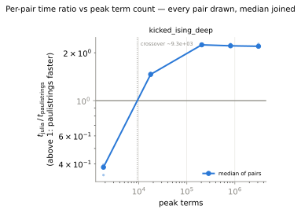
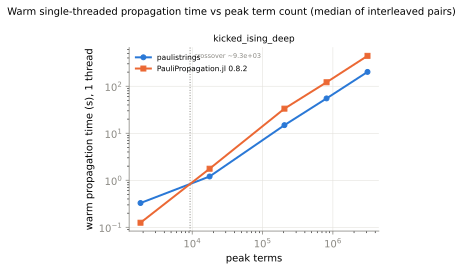
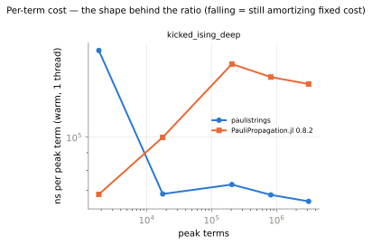
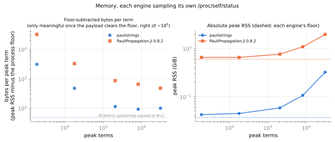

# Deep kicked-Ising: the saturation hypothesis's falsification test

> ## ✅ VERDICT: the saturation hypothesis **HOLDS**
>
> The 5-step kicked-Ising curve's ratio decay above 6.4 × 10⁵ terms **does not reproduce** when the
> same circuit family is run deep enough that 3 × 10⁶ terms is far from the reachable Pauli set's
> closure. Over a span of comparable width the 5-step curve's advantage fell **−27.8 %**
> (1.925 → 1.389); here it moves **−0.7 %** (2.212 → 2.197). The decay is a *near-closed-sum
> regime*, not a large-`m` property of this engine.

The parent study is [`../README.md`](../README.md); its protocol, ratio convention, acceptance rule
and caveats apply here unchanged and are not restated. This document reports only what the
follow-up run adds. The prediction being tested is that study's "Falsifiable prediction for the
follow-up campaign".

Driver: `benchmarks/python/bench_jl_performance.py`, workload `kicked_ising_deep`.
Data: `results.json`, `summary.json`, transcript `run.log`, figures alongside.

## What changed, and only what changed

| | 5-step curve (parent study) | this run |
|---|---|---|
| circuit | heavy-hex kicked-Ising, 127 q, `theta_zz = -pi/2` | **same** |
| observable / state | `Z_62` / `z+`, Heisenberg | **same** |
| Trotter steps | 5 (1355 channels) | **20 (5420 channels)** |
| `theta_h` | `5pi/16` | **`7pi/32`** |
| cutoffs | 2⁻⁴ … 2⁻¹⁸, dyadic | 2⁻⁸, 2⁻¹⁰, 2⁻¹², **2⁻¹³**, 2⁻¹⁴, dyadic |
| pairs per configuration | 5 | **3** (see "Protocol deviations") |

The angle and depth are not new: benchmark C already proved per-layer parity at exactly
`theta_h = 7pi/32`, 20 steps, `min_abs_coeff = 2⁻¹⁴`, and this run reproduces its committed term
counts **exactly** — 2 441 936 final / 3 108 582 peak. The extension binary is byte-identical to the
one the parent study measured (mtime `2026-09-01 03:19:44`; `git diff 9d43886 HEAD -- crates/` is
empty), so nothing about the engine moved between the two campaigns.

## 1. The premise: this sweep really is far from closure

The hypothesis needs the deep circuit to be *unsaturated* where the shallow one was saturated. It is,
by more than two orders of magnitude in the growth rate:

| sweep | cutoff step | term growth |
|---|---|---|
| 5-step, 2⁻¹⁶ → 2⁻¹⁸ | ×4 tighter | **×1.0116** (+1.16 %) — reachable set exhausted |
| **deep, 2⁻¹² → 2⁻¹³** | ×2 tighter | **×4.191** |
| **deep, 2⁻¹³ → 2⁻¹⁴** | ×2 tighter | **×4.215** |

Two consecutive halvings each multiply the term count by ~4.2 — a clean `terms ∝ eps^-2.07` power law
with no sign of flattening at 2.4 × 10⁶ terms. Peak terms grow ×3.97 and ×3.82 over the same steps.
The premise holds.

## 2. Results

All five configurations passed the parity gate: **all 5420 per-layer term counts identical** on every
one, expectations agreeing to ≤ 2.2 × 10⁻¹⁶ against a 1e-9 bar. No configuration was disqualified,
none was cut, and **all 15 pairs agreed in sign**.

| `min_abs_coeff` | final terms | peak terms | rust s | jl s | median ratio | pairs agree | faster |
|---|---|---|---|---|---|---|---|
| 2⁻⁸ = 0.003906 | 363 | 1 838 | 0.3285 | 0.1252 | **0.381** | 3/3 | Julia |
| 2⁻¹⁰ = 9.766e-4 | 8 046 | 17 659 | 1.206 | 1.763 | **1.462** | 3/3 | paulistrings |
| 2⁻¹² = 2.441e-4 | 138 220 | 204 728 | 14.89 | 33.40 | **2.244** | 3/3 | paulistrings |
| 2⁻¹³ = 1.221e-4 | 579 312 | 813 262 | 55.18 | 121.6 | **2.212** | 3/3 | paulistrings |
| 2⁻¹⁴ = 6.104e-5 | 2 441 936 | 3 108 582 | 202.0 | 443.7 | **2.197** | 3/3 | paulistrings |

Per-pair ratios (the acceptance rule is about their agreement in sign, so all are shown):

| `min_abs_coeff` | pair 0 | pair 1 | pair 2 | spread |
|---|---|---|---|---|
| 2⁻⁸ | 0.340 | 0.381 | 0.395 | 16 % |
| 2⁻¹⁰ | 1.430 | 1.494 | 1.462 | 4.5 % |
| 2⁻¹² | 2.244 | 2.274 | 2.227 | 2.1 % |
| 2⁻¹³ | 2.212 | 2.271 | 2.202 | 3.1 % |
| 2⁻¹⁴ | 2.197 | 2.172 | 2.273 | 4.6 % |

The within-configuration spread at the three heavy points is 2–5 %, which bounds how much of the
−2.1 % ratio movement across them can be called a trend at all: none of it.

Crossover: **≈ 9.32 × 10³ peak terms**, bracketed by 1 838 @ 0.381 and 17 659 @ 1.462, no
indistinguishable zone. That is 2.5× the 5-step workload's 3.79 × 10³ — consistent with this engine's
known fixed per-layer cost, which a 4× deeper circuit pays 4× more often at small term counts, and
which is a separate matter from the large-`m` question this run asks.





## 3. The verdict, and the numbers that decide it

**HOLDS.** Four independent readings, all pointing the same way:

**(a) The decay does not reproduce, over a span of the same width.** Comparing like with like — a
~3.5× increase in peak terms starting from the parent study's ratio peak:

| sweep | peak terms | ratio | change |
|---|---|---|---|
| 5-step | 637 219 → 2 146 424 (×3.4) | 1.925 → 1.389 | **−27.8 %** |
| **deep** | 813 262 → 3 108 582 (×3.8) | 2.212 → 2.197 | **−0.7 %** |

Widening the deep window to its full measured range — 204 728 → 3 108 582 peak terms, a **15.2×**
span that entirely contains and exceeds the band the 5-step curve decayed across — moves the ratio
2.244 → 2.197, **−2.1 %**, inside the 2–5 % per-pair spread.

**(b) The mechanism check passes: Julia's per-term discount is absent.** The prediction was that
Julia's per-term cost would stay flat instead of dropping 35 %.

| sweep | span | rust ns/peak-term | jl ns/peak-term |
|---|---|---|---|
| 5-step | 637 219 → 2 146 424 | 1 252 → 1 120 (**−10.6 %**) | 2 423 → 1 567 (**−35.3 %**) |
| **deep** | 204 728 → 3 108 582 | 72 731 → 64 981 (**−10.7 %**) | 163 143 → 142 734 (**−12.5 %**) |
| **deep** (tail only) | 813 262 → 3 108 582 | 67 850 → 64 981 (**−4.2 %**) | 149 521 → 142 734 (**−4.5 %**) |

This is the crux. Our own amortization is *identical* in the two campaigns (−10.6 % vs −10.7 %) —
whatever happens in the 5-step run, it does not happen to us. Julia's is not: −35.3 % where the sum
is closing, −12.5 % where it is not, and in the deep tail the two engines amortize at the same rate
(−4.2 % vs −4.5 %), which is exactly why the ratio is flat. Julia's extra 23 points of improvement in
the 5-step run appear only in the regime where nearly every gate application is a hash-map hit.



(Absolute ns/peak-term is **not** comparable between the two workloads: the deep circuit applies 4×
the channels and holds a large sum across most of them, whereas the 5-step run reaches its peak only
in its final layers. Only the *trend within* each curve carries meaning, and that is all that is read
off it here.)

**(c) At matched term count, closeness to closure — not `m` — predicts the ratio.** 5-step at
2.12 × 10⁶ peak terms: **1.431**. Deep at 3.11 × 10⁶ peak terms, i.e. 47 % *more* terms: **2.197**, a
1.54× larger advantage. If the decay were a large-`m` property of this engine, the deeper run at more
terms would have to be worse, and it is 54 % better.

**(d) Nothing on our side degrades anywhere in the sweep.** Our per-term cost is still falling at
3.1 × 10⁶ terms (−4.2 % over the last 3.8×), and our peak RSS at that point is 0.323 GiB.

**One honest qualification.** The prediction's stronger form — that the ratio would keep *rising*,
XXZ-like — is not met: it plateaus at ~2.2 rather than climbing. The falsification criterion as
written was "if the ratio decays anyway, the hypothesis is wrong", and it does not decay; but a
plateau is weaker evidence than a rise, and the honest reading is that removing saturation removes
the decay without turning it into growth. Whatever is still very slowly compressing the ratio at the
top of this sweep is a −0.7 %-per-3.8×-terms effect, i.e. two orders of magnitude too small to be the
thing the parent study saw.

### Consequence for the optimization campaign

The 5-step decay is **not a regression to fix**. The actionable converse stands unchanged and is now
better founded: a merge path that recognizes a layer producing no new keys and skips the sort would
claw back precisely the discount a hash map gets for free in the near-closed regime — an
*opportunity* in a specific regime, not a repair of a large-`m` weakness. Any large-`m` work in this
campaign has to be justified by its own roofline evidence, because this data shows no large-`m`
deficit relative to PauliPropagation.jl.

## 4. Memory

Floors match the parent study exactly: **37.7 MB** for us, **0.601 GiB** for Julia (×16.0).

| peak terms | rust peak | rust B/term | jl peak | jl B/term | jl / rust |
|---|---|---|---|---|---|
| 1 838 | 0.042 GiB | 3 078 † | 0.655 GiB | 32 021 † | 10.4× |
| 17 659 | 0.045 GiB | 471 † | 0.654 GiB | 3 251 † | 6.9× |
| 204 728 | 0.058 GiB | **112** | 0.765 GiB | **855** | 7.6× |
| 813 262 | 0.106 GiB | **92** | 1.091 GiB | **646** | 7.0× |
| 3 108 582 | 0.323 GiB | **99** | 1.970 GiB | **473** | 4.8× |

† below ~10⁵ terms the floor-subtracted figure is allocator granularity, not payload.

**The parent study's 91 → 125 B/term step does not appear here** — 92 → 99 B/term across a 3.8×
increase, with peak RSS growing 3.05× for 3.82× the terms (i.e. *sub*-linearly). That is not evidence
the step was spurious; this sweep's grid jumps straight over the 1.5–2.1 × 10⁶ band where it was
seen. What the two datasets together do is corroborate the study's diagnosis of it as a
**power-of-two capacity artifact**. Normalizing each point by its allocated-capacity slack
`2^ceil(log2 m) / m`:

| campaign | peak terms | capacity | slack | B/term | slack-normalized |
|---|---|---|---|---|---|
| 5-step | 637 219 | 2²⁰ | 1.65 | 105 | 64 |
| 5-step | 1 544 083 | 2²¹ | 1.36 | 91 | 67 |
| 5-step | 2 121 774 | 2²² | 1.98 | 125 | 63 |
| 5-step | 2 146 424 | 2²² | 1.95 | 123 | 63 |
| **deep** | 813 262 | 2²⁰ | 1.29 | 92 | 71 |
| **deep** | 3 108 582 | 2²² | 1.35 | 99 | 73 |

Six points across two campaigns collapse to 63–73 B/term of live payload once the slack is divided
out, against 48 B/term of `W = 2` arithmetic. The 91 → 125 jump is then just 1.36 → 1.98 slack: the
term count crossed 2²¹ and every bucket doubled at once. Exact-size final allocation, or a gentler
growth factor, is worth up to ~1.5× of peak RSS in the worst case and nothing in the best — a real
but bounded target, and one whose size is now known. (This is a model consistent with both datasets,
not a measured mechanism; a direct allocator probe would settle it.)

Julia's side carries its own corroboration of the hypothesis: its 237 B/term at the 5-step run's
2.12 × 10⁶ terms, where its RSS *plateaued* at 1.07 GiB across two configurations, is the cheapest
per-term figure anywhere in either campaign — a dict that has stopped growing. Here, still inserting,
it pays **473 B/term** at 3.11 × 10⁶ terms.



## 5. Protocol deviations

Everything else follows the parent study's protocol exactly; these three are the differences, all
decided before the timed run and recorded in `research/notes/2026-09-01-large-m-campaign-log.md`.

1. **3 pairs per configuration, not 5.** Projected from a pilot: 5 pairs was ~192 min against a
   ~75 min budget, 3 pairs ~116 min (actual: **116.9 min**). Three is the floor, not two —
   `benchmarks/PROFILING.md`'s A/B harness bar is 3, and direction consistency needs at least that.
   The cost is precision on each median, and it is affordable here because the signal being resolved
   is the difference between ~2.2 and ~1.4, far outside the 2–5 % per-pair spread. Dropping the
   2⁻¹⁴ point instead was never an option: it is the point the verdict rests on.
2. **The pilot was restricted to the three loosest cutoffs.** The driver's `--pilot` sweeps all five
   at one pair; its 2⁻¹³/2⁻¹⁴ tail would have duplicated ~40 min of the timed run's own parity
   gates. The restricted pilot ran through the driver's own `parity_gate` / `run_pairs`, so the
   plumbing it exercised — task files, `runner.jl` on a 5420-gate task, the parity gate, pairing,
   memory sampling — is identical. Its numbers appear nowhere in this report.
3. **A rust-only term-count probe preceded the pilot**, to size the run and confirm the workload
   reproduces benchmark C's counts. It is a decision aid; none of its timings are reported.

No parity failure, no disqualification, no cut leg, no mixed-sign configuration. The box was quiet
throughout (load ≤ 1.5, no other tenant), 240 GiB free at both ends of the run.

## Reproducing

```bash
RAYON_NUM_THREADS=1 python benchmarks/python/bench_jl_performance.py \
    --curves --workload kicked_ising_deep --pairs 3 \
    --out benchmarks/python/jl_performance/deep-kicked-ising

# re-render figures from the committed data, no measurement
python benchmarks/python/jl_performance_figures.py \
    benchmarks/python/jl_performance/deep-kicked-ising/summary.json

# the CI protocol gate, which pins this workload's mirror (no julia, < 1 s)
pytest python/paulistrings/tests/test_jl_performance_protocol.py
```

Host ccqlin038 (2 × Xeon Gold 6244, `powersave`), Julia 1.12.6 + PauliPropagation.jl 0.8.2,
`PP_BACKEND=dict`, `PP_FUSED=0`, rustc 1.94.0, driver commit `e4aeccd` with a clean tree.
