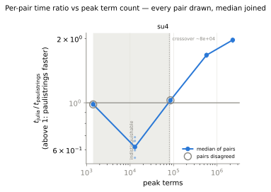
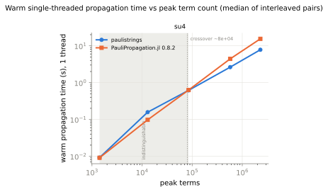
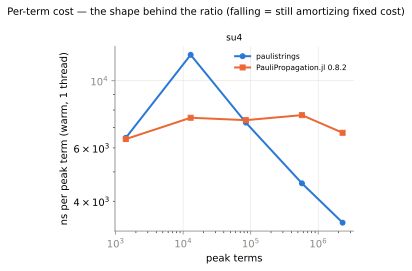
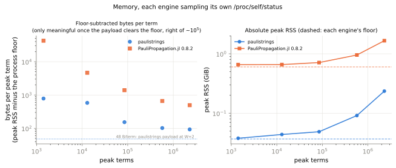

# SU(4) brickwork: the matrix-gate path

The one workload in the study that drives matrix gates rather than rotations: `unitary_2q`, a local PTM with
fanout up to 16, against PauliPropagation.jl's dense 16×16 `TransferMapGate`. It is also the shortest circuit
(105 channels against the rotation workloads' 1355–5420) and the only one at `W = 1`, where the payload is
32 B/term rather than 48. Those pull the curve in opposite directions, and the tables below separate them.

The protocol, ratio convention (`ratio = t_julia / t_paulistrings`, `> 1` means `paulistrings` is faster),
acceptance rule and caveats live in [`../README.md`](../README.md).

Driver: `benchmarks/python/bench_jl_performance.py`, workload `su4` at its committed cutoff grid, driver commit
`35ff414`. Engine `crates/` tree `4768fe4`, extension built 2026-09-01 03:19:44, the same binary [`../`](../) and
[`../deep-kicked-ising/`](../deep-kicked-ising/) measure, so all three are directly comparable.

## Results

All five configurations passed the per-layer parity gate: all 105 counts identical on every one, expectations
agreeing to ≤ 1.2 × 10⁻¹⁶ against a 1e-9 bar. At `min_abs_coeff = 1e-3` the expectation is
`-0.0030947264746490136`, bit-identical to the value benchmark E committed, so this is that circuit.

| `min_abs_coeff` | final terms | peak terms | rust s | jl s | rust ns/term | jl ns/term | ratio | pairs | faster |
|---|---|---|---|---|---|---|---|---|---|
| 1e-2 | 193 | 1 416 | 0.00917 | 0.00909 | 6 477 | 6 417 | 0.983 | 0/5 | indistinguishable |
| 3e-3 | 7 089 | 12 924 | 0.1574 | 0.09754 | 12 175 | 7 547 | 0.620 | 5/5 | Julia |
| 1e-3 | 84 836 | 84 836 | 0.6171 | 0.6286 | 7 274 | 7 410 | 1.027 | 0/5 | indistinguishable |
| 3e-4 | 573 826 | 573 826 | 2.630 | 4.417 | 4 584 | 7 697 | 1.676 | 5/5 | paulistrings |
| 1e-4 | 2 296 294 | 2 296 294 | 7.806 | 15.46 | 3 399 | 6 732 | 1.974 | 5/5 | paulistrings |

| `min_abs_coeff` | pair 0 | pair 1 | pair 2 | pair 3 | pair 4 | spread |
|---|---|---|---|---|---|---|
| 1e-2 | 1.007 | 0.999 | 0.972 | 0.983 | 0.977 | 3.6 % |
| 3e-3 | 0.552 | 0.598 | 0.662 | 0.689 | 0.620 | 22.2 % |
| 1e-3 | 1.036 | 1.027 | 1.022 | 0.995 | 1.040 | 4.4 % |
| 3e-4 | 1.644 | 1.692 | 1.676 | 1.667 | 1.699 | 3.3 % |
| 1e-4 | 1.999 | 1.934 | 1.989 | 1.940 | 1.974 | 3.3 % |

Two of the five are ties, both at a ratio of ~1, which is what a tie should look like. The 22 % spread at 3e-3 is
entirely on this engine's side: its leg ranges 0.142–0.176 s across the five pairs while Julia's holds
0.097–0.099 s, on a 0.16 s measurement, and all five pairs still agree in sign. The `abba` alternation earns its
keep at the heaviest point, where rust-first pairs median 1.989 and julia-first 1.937, a consistent 2.7 % order
effect; the quoted 1.974 is the median across both orders.

Above the dip this engine's cost per term falls 72 % (12 175 → 3 399 ns) and is still falling 26 % across the last
4× alone, while Julia's moves −11 % overall and is non-monotone. Julia gets no per-term discount here, because
this sweep is nowhere near closure: a 3× tightening still multiplies the term count 4.0×. That is the dependence
[`../deep-kicked-ising/README.md`](../deep-kicked-ising/README.md) isolates.







## Crossover

Interpolated **8.01 × 10⁴ peak terms**, bracketed by the two sign-consistent neighbours 12 924 @ 0.620 and
573 826 @ 1.676. `summary.json` flags it `inside_indistinguishable_zone: true`, which needs reading carefully. The
driver's "zone" is the min–max span over all mixed-sign configurations, here 1 416 … 84 836, but the 12 924 point
inside that span is unanimous at 0.620, so the band is not uniformly unresolved. What the flag reflects is that
the 1e-3 configuration is itself a measured tie (median 1.027, pairs 0.995–1.040 straddling 1) at 84 836 peak
terms, which is not a failure to resolve the crossover but landing on it. The 1 416-term tie is a separate
phenomenon at the small-`m` end, on the far side of a region where Julia is clearly faster: this ratio curve runs
tie → dip → tie → rise, not the rotation workloads' monotone climb.

Crossovers of the four workloads measured on this engine build:

| workload | channels | crossover (peak terms) | vs su4 |
|---|---|---|---|
| `kicked_ising` | 1355 | 3.79 × 10³ | 21.1× lower |
| `kicked_ising_deep` | 5420 | 9.32 × 10³ | 8.6× lower |
| `xxz` | 1782 | 1.65 × 10⁴ | 4.9× lower |
| `su4` | 105 | 8.01 × 10⁴ | — |

A 21× spread across four workloads, and specifically 21× against kicked-Ising rather than against every rotation
workload, since it is only 4.9× XXZ's.

## Memory

Floors are 37.8 MB for this engine against Julia's 0.601 GiB, a factor of 16.3.

| peak terms | rust peak | rust B/term | jl peak | jl B/term | jl / rust | capacity slack | rust slack-normalized |
|---|---|---|---|---|---|---|---|
| 1 416 | 0.038 GiB | 793 † | 0.657 GiB | 42 629 † | 53.8× | 1.45 | — |
| 12 924 | 0.044 GiB | 581 † | 0.659 GiB | 4 777 † | 8.2× | 1.27 | — |
| 84 836 | 0.049 GiB | 151 | 0.712 GiB | 1 404 | 9.3× | 1.55 | 98 |
| 573 826 | 0.091 GiB | 102 | 0.955 GiB | 662 | 6.5× | 1.83 | 56 |
| 2 296 294 | 0.235 GiB | 93 | 1.660 GiB | 495 | 5.3× | 1.83 | 51 |

† below ~10⁵ terms the floor-subtracted figure is allocator granularity, not payload.

Bytes per term fall monotonically, with no capacity step, and none is expected: this grid places both heavy points
at the same power-of-two slack (1.83), so the sweep adds two consistent points to the
[capacity-doubling model](../deep-kicked-ising/README.md#memory) without testing it further. Divided by that
slack, 56 and 51 B/term against `W = 1`'s 32 B/term payload arithmetic is an overhead factor of 1.6–1.8×, where
the two `W = 2` sweeps' six large points give 63–73 against 48, i.e. 1.3–1.5×. The overhead does not shrink with
`W`, which is what a fixed 16-byte coefficient plus `W`-independent transient buffers predicts. Julia pays
495 B/term here at 36 qubits (a single `UInt64` key) against 350 B/term on XXZ's 100 qubits, so its dict overhead
is not dominated by key width either.



## What this says about the matrix-gate path

1. **Fanout-16 gather/merge is not a large-`m` problem.** At 2.30 × 10⁶ peak terms this path reads 1.974 and is
   still rising at +17.8 % per 4× terms, above kicked-Ising's 1.431 at 2.12 × 10⁶ and XXZ's 1.798 at 2.66 × 10⁶
   on the same engine build, second only to the deep sweep's 2.197 at 3.11 × 10⁶.
2. **It is a mid-`m` problem, quantified at 1.61× behind at 1.29 × 10⁴ peak terms.** That is the deepest point any
   workload reaches in the 6 × 10³–2 × 10⁴ band (kicked-Ising 1.126 at 6 311, XXZ 0.895 at 9 918, deep 1.462 at
   17 659), and it is what pushes the crossover out to 8 × 10⁴. Work aimed at this path buys the most between
   ~10⁴ and ~10⁵ terms; above 5 × 10⁵ it already wins by 1.7–2.0×.
3. **It is not the fixed per-layer cost**, which at 1 416 peak terms leaves the two engines tied (0.983) where the
   rotation workloads sit at 0.32–0.46, because 105 channels pay the rebucket → permute → coset-loop overhead 105
   times instead of 1355–5420 times.
4. **Where the deficit comes from is not settled by this data.** It is created entirely in the 193 → 7 089-term
   step, where this engine's time grows ×17.2 against Julia's ×10.7, and is repaid over every later step. A
   plausible reading is that a sum of ~10⁴ terms is still cache-resident for a hash map, so Julia's dict path is
   near its cheapest exactly there, while a gather → sort → merge over a 16-way expansion pays its full cost from
   the first term. That is consistent with Julia's flat per-term curve above 8 × 10⁴ but is not a measured
   mechanism; a `phase-timing` breakdown of a `unitary_2q` layer at 10⁴ terms would settle it.

## Protocol

The parent protocol was followed exactly, at 5 pairs, with nothing waived. The workload was not extended, since a
rust-only probe put the tightest cutoff at 2.30 × 10⁶ peak terms and the committed five-cutoff grid was therefore
used unchanged. That probe and a 1-pair pilot preceded the timed run as sizing aids; none of their timings are
reported, and the pilot's five single-pair ratios (0.976 / 0.642 / 1.076 / 1.672 / 1.977) reproduce the timed
medians inside the per-pair spread. The full run took 13.4 min on a box that was quiet throughout (load ≤ 1.0, no
other tenant), 240 GiB free at both ends.

## Reproducing

```bash
RAYON_NUM_THREADS=1 python benchmarks/python/bench_jl_performance.py \
    --curves --workload su4 --pairs 5 \
    --out benchmarks/python/jl_performance/su4-curve

# re-render figures from the committed data, no measurement
python benchmarks/python/jl_performance_figures.py \
    benchmarks/python/jl_performance/su4-curve/summary.json

# the CI protocol gate, which pins this workload's mirror (no julia, < 1 s)
pytest python/paulistrings/tests/test_jl_performance_protocol.py
```

Host ccqlin038 (2 × Xeon Gold 6244, `powersave`), Julia 1.12.6 with PauliPropagation.jl 0.8.2, `PP_BACKEND=dict`,
`PP_FUSED=0`, rustc 1.94.0, driver commit `35ff414` with a clean tree. The same sweep on engine `81c568a` is
[`../post-optimization/su4-curve/`](../post-optimization/su4-curve/).
