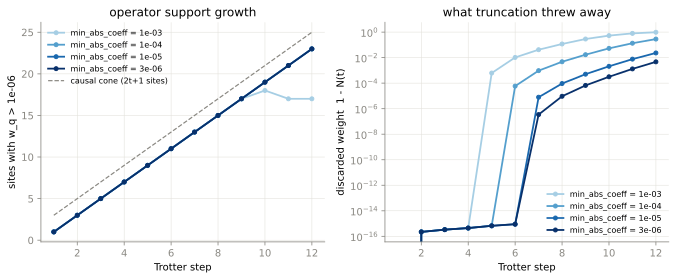
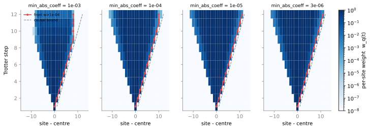
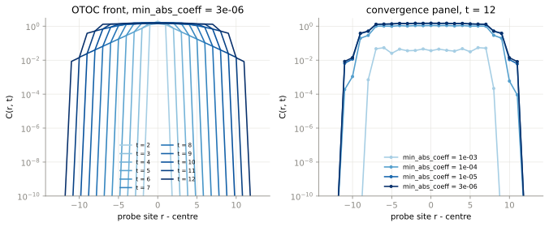
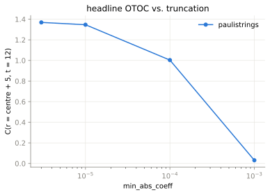
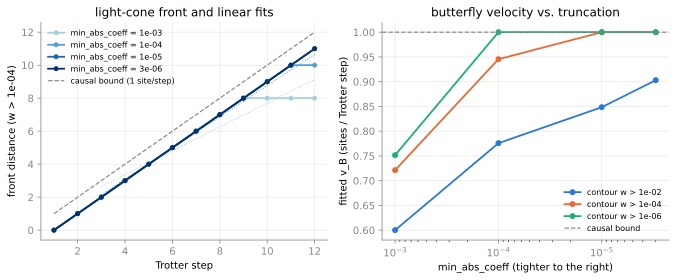
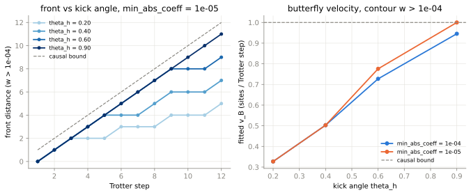
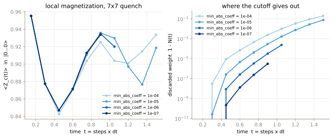
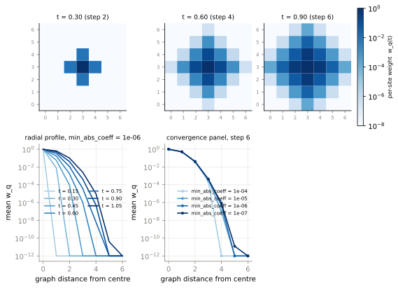
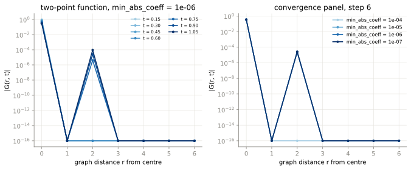
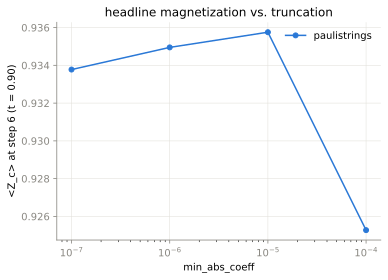

# B1 — real-time operator scrambling, light cones and OTOCs

Handoff item B1; adapted spec in
`research/plans/2026-08-31-examples-benchmarks-suite.md` §6 Part B. Scripts:
[`run_b1_1d.py`](run_b1_1d.py) (phase 1, 1D chain) and
[`run_b1_2d.py`](run_b1_2d.py) (phase 2, 2D quench), sharing the analysis
helpers in [`scrambling.py`](scrambling.py). CI-safe correctness gate:
[`python/paulistrings/tests/test_showcase_b1.py`](../../python/paulistrings/tests/test_showcase_b1.py).

Everything below is measured by these scripts; no number is quoted from
literature and none is asserted by hand. Every curve carries a
`min_abs_coeff` convergence panel (plan §7 rule 4) and, next to it, the
retained Hilbert–Schmidt norm — the quantity that says how much of the
operator the truncation deleted.

## 1. What is being computed

The Heisenberg-evolved operator is a Pauli sum,

```
O(t) = U(t)† O U(t) = Σ_P c_P(t) P ,        O = Z_c  (one site, the centre)
```

with the repo's Hermitian convention (`Y → (x=1, z=1)`, no phase), so the
`c_P` are real. Normalize the trace inner product as `⟨A,B⟩ = Tr(A†B)/2ⁿ`,
which makes the Pauli strings orthonormal:

```
N(t) = ⟨O(t), O(t)⟩ = Σ_P |c_P(t)|²
```

is conserved by exact unitary evolution and equals 1 for the seed `Z_c`.
**Under truncation `N(t)` only falls, and `1 − N(t)` is exactly the fraction
of the operator that was thrown away.** That is the convergence diagnostic
used throughout.

### 1.1 Operator support and the light cone

```
w_q(t) = Σ_{P : P_q ≠ I} |c_P(t)|²
```

is the weight acting non-trivially on qubit `q` — implemented as
`scrambling.support_profile` by unpacking the symplectic `x`/`z` bit columns
of the export and accumulating `|c|²` per site in one chunked pass (the
chunking matters: a converged run here reaches 2·10⁸ terms, where a dense
`(terms, n)` bit matrix would be tens of GiB). `w_q(t)` plotted against
`(site, t)` *is* the light cone; `support_size` counts the sites clearing a
floor.

### 1.2 The OTOC, derived

The infinite-temperature squared commutator of the evolved operator with a
single-site probe Pauli `W_r` is

```
C(r,t) = ½ ⟨[W_r, O(t)], [W_r, O(t)]⟩ .
```

Take it apart string by string. `W_r` is a Pauli, so each `P` either commutes
with it (`[W_r,P] = 0`) or anticommutes (`W_r P = −P W_r`), in which case

```
[W_r, P] = W_r P − P W_r = 2 W_r P .
```

Writing `A = Σ_{P anti} c_P P` for the anticommuting part gives
`[W_r, O(t)] = 2 W_r A`, and since `W_r` is unitary,
`⟨2W_r A, 2W_r A⟩ = 4⟨A,A⟩ = 4 Σ_{P anti} |c_P|²` by orthonormality. Hence

```
C(r,t) = 2 · Σ_{P anticommuting with W_r} |c_P(t)|² .          (★)
```

Equivalently, with the more familiar OTOC
`F(r,t) = ⟨W_r O(t) W_r, O(t)⟩ = Σ_P s_P |c_P|²` (`s_P = ±1` by
commutation), splitting `N = Σ_comm + Σ_anti` gives `F = N − 2Σ_anti`, so

```
C(r,t) = N(t) − F(r,t) ,
```

the form the handoff quotes. `(★)` is what the code evaluates, because it
needs no cancellation between large numbers.

**Normalization.** `(★)` is written for the *unnormalized* evolved operator, so
it inherits whatever norm truncation left: `0 ≤ C ≤ 2N(t) ≤ 2`, with equality on
the right when *every* remaining string anticommutes with the probe — which is
the case at `t = 0`, where `C(c,0) = 2`. Nothing in these scripts divides by a shrinking
`N`; a curve that drifts because truncation is losing norm is supposed to
look like it. For a Haar-scrambled operator half the weight anticommutes with
any given single-site probe, so the late-time saturation value is `C → 1`.

**One symplectic bit.** For `P` with bits `(x_r, z_r)` at site `r` and `W`
with `(a, b)`, they anticommute iff `x_r b + z_r a = 1 (mod 2)`:

| probe | anticommutes iff |
|---|---|
| `W = X_r` | `z_r(P) = 1` |
| `W = Z_r` | `x_r(P) = 1` |
| `W = Y_r` | `x_r(P) ≠ z_r(P)` |

so one pass over the bit columns yields `C(r,t)` for **every** site and all
three probes at once.

### 1.3 A free cross-check: the probe-averaged OTOC *is* the support profile

Average `(★)` over `W_r ∈ {X_r, Y_r, Z_r}`. A string with `P_r = I`
anticommutes with none of them; a string with `P_r ≠ I` anticommutes with
exactly two. So

```
⅓ Σ_W C_W(r,t) = ⅔ · 2 · Σ_{P_r ≠ I} |c_P|² = (4/3) · w_r(t) .
```

The identity is exact string by string, so comparing the two independently
accumulated arrays is a machine-precision self-test of both. Both scripts
assert it at every step (`scrambling.probe_average_gap`), and the runs below
report it at `0.0`–`2·10⁻¹⁶`.

### 1.4 The two-point function comes for free too

`G(r,t) = ⟨Z_r, O(t)⟩ = Tr(Z_r U† Z_c U)/2ⁿ` is the infinite-temperature
dynamical correlator — and in the Pauli basis it is *literally the
coefficient of the weight-one string* `Z_r` in the evolved sum. No second
propagation, no contraction: `scrambling.single_pauli_coefficients` finds the
weight-one rows by popcount and reads their coefficients off.

## 2. Validation: an independent dense path

`scrambling.dense_*` builds `U(t)` as an explicit `2ⁿ × 2ⁿ` matrix by
Kronecker products (`exp(−iθP/2) = cos(θ/2)I − i sin(θ/2)P` for every gate in
these circuits) and evaluates the same quantities with dense linear algebra —
no `PauliSum`, no engine, no qiskit. The support profile is obtained there
from the single-qubit Pauli twirl `T_q(O) = ¼ Σ_{g∈{I,X,Y,Z}_q} g O g`, which
projects onto the strings carrying identity at `q`, so
`w_q = ⟨O,O⟩ − ⟨T_q O, T_q O⟩` with no Pauli decomposition anywhere.

`run_b1_1d.py` Part 1 — `n = 9`, 4 Trotter steps, untruncated (1430 terms):

| compared quantity | max gap, engine vs dense |
|---|---:|
| every coefficient, `c_P` vs `⟨P, O(t)⟩` | 6.7·10⁻¹⁶ |
| `⟨O,O⟩` (rules out a *missing* term) | 3.1·10⁻¹⁵ |
| support profile `w_q`, vs the dense twirl | 4.0·10⁻¹⁵ |
| OTOC `C_X(r)`, vs a dense commutator | 5.8·10⁻¹⁵ |
| OTOC `C_Y(r)` | 5.3·10⁻¹⁵ |
| OTOC `C_Z(r)` | 3.8·10⁻¹⁵ |
| two-point function `G(r)` | 4.9·10⁻¹⁷ |
| probe-average identity `⅓ΣC_W − (4/3)w_r` | 2.2·10⁻¹⁶ |

Worst gap 5.8·10⁻¹⁵, against the script's 10⁻¹⁰ bar — i.e. agreement at
double-precision rounding, on every quantity this showcase reports.

The truncated leg of the same comparison calibrates the diagnostic: at
`min_abs_coeff = 0.05` (deliberately coarse — at this depth a cutoff of 10⁻³
removes only the numerically-zero dust left by cancellation in the merge and
loses no norm at all) the run keeps 54 of 1430 terms, discards **0.318** of the
norm, and its worst per-site weight error is **0.280** — a ratio of 0.88. The
error in `w_q` tracks the norm that was deleted, which is what licenses
`1 − N(t)` as the error proxy for every curve below. It is a calibration, not a
theorem: truncation runs after every channel and perturbs the coefficients that
survive as well as deleting others, so only the order of magnitude is expected
to match, and the script asserts a factor-of-10 band rather than an inequality.

`run_b1_2d.py` Part 1 runs the same comparison on a 3×3 lattice (9 qubits),
adding the quench magnetization against `⟨0…0|O(t)|0…0⟩` read off the dense
matrix element:

| compared quantity | max gap, engine vs dense |
|---|---:|
| coefficients (1134 of 61 978 checked; see below) | 3.8·10⁻¹⁵ |
| `⟨O,O⟩` | 1.3·10⁻¹⁴ |
| support profile `w_q` | 1.4·10⁻¹⁴ |
| OTOC `C_X` / `C_Y` / `C_Z` | 2.1 / 1.6 / 1.7 ·10⁻¹⁴ |
| two-point function `G(r)` | 3.8·10⁻¹⁵ |
| quench magnetization `⟨0…0\|O(t)\|0…0⟩` | 6.6·10⁻¹⁵ |
| probe-average identity | 2.2·10⁻¹⁶ |

Worst gap 2.1·10⁻¹⁴ against the same 10⁻¹⁰ bar. The per-term check runs over a
bounded, deterministic sample (the 500 largest coefficients plus a fixed stride
through the rest): a dense `⟨P,O⟩` costs about a millisecond and this sum holds
62 000 terms, so checking every one would dominate the script's runtime for no
extra coverage — and it is the `⟨O,O⟩` agreement, not the per-term check, that
rules out a *missing* term.

## 3. Phase 1 — the 1D chain

Setup: an open `n = 61` chain (`scrambling.chain_edges` fed to
`circuits.heavy_hex_kicked_ising`, so 1D, 2D and the rest of the suite share
one builder and one truncation schedule), the kicked-Ising Clifford entangler
`θ_zz = −π/2`, kick angle `θ_h = 0.9`, seed `Z_30`, 12 Trotter steps,
`direction="heisenberg"`.

The whole time series costs **one** 12-step propagation: for `U(t) = Sᵗ`,
`U(t)† O U(t) = (S†)ᵗ O Sᵗ`, and because this engine truncates after every
channel, `t` successive `propagate` calls on the one-step circuit apply
exactly the same (apply-adjoint, truncate) sequence as one call on the
`t`-step circuit — the identity showcase B5 pins in
`test_showcase_b5.py::test_backpropagated_task_reproduces_full_circuit_under_a_shared_policy`.

### 3.1 The exact cone (Clifford point)

At `θ_h = π/2` *and* `θ_zz = −π/2` every gate is Clifford, so one Pauli
string evolves into one Pauli string with unit coefficient: its support is the
**exact** causal cone, measured rather than assumed, and no truncation can put
weight outside it. (`n = 41`, 8 steps — a separate, cheap run, since the point is
the cone rather than the scrambling.)

| Trotter step | strings in the sum | Pauli weight | cone radius |
|---:|---:|---:|---:|
| 1 | 1 | 1 | 0 |
| 2 | 1 | 3 | 1 |
| 3 | 1 | 5 | 2 |
| 4 | 1 | 7 | 3 |
| 5 | 1 | 9 | 4 |
| 6 | 1 | 11 | 5 |
| 7 | 1 | 13 | 6 |
| 8 | 1 | 15 | 7 |

The cone radius grows at exactly **1.000 sites per Trotter step**, which is the
structural bound: one step is a single-site `X` layer (no spreading) followed by
one *commuting* `ZZ` layer, which can move the operator boundary by at most one
bond. The offset (radius `t − 1` rather than `t`) is real and not a bug: in the
Heisenberg direction the channel list runs in reverse, so the first layer the
`Z`-type seed meets is a `ZZ` layer it commutes through, and the last is an `X`
layer that cannot spread. Every velocity below is measured against this bound.

(The Clifford run uses `min_abs_coeff = 10⁻¹²`, which is not a physical
truncation: at `θ_h = π/2` the vanishing branch has coefficient
`cos(π/2) = 6.1·10⁻¹⁷` rather than an exact zero, and without the cutoff the
"single string" is two strings, one of them dust.)

### 3.2 Support growth, and where the cutoff gives out

Four cutoffs, twelve steps each. Per cutoff, at the final step:

| `min_abs_coeff` | terms at `t=12` | `N(12)` | support (`w>10⁻⁶`) | front (`w>10⁻⁴`) | wall time, 12 steps |
|---:|---:|---:|---:|---:|---:|
| 10⁻³ | 11 900 | 0.0273 | 17 | 8 | 0.3 s |
| 10⁻⁴ | 4 342 184 | 0.7158 | 23 | 10 | 2.2 s |
| 10⁻⁵ | 75 099 815 | 0.9767 | 23 | 11 | 25.4 s |
| 3·10⁻⁶ | 227 673 152 | 0.9953 | 23 | 11 | 63.5 s |

and the retained norm `N(t)` step by step — the convergence panel, in numbers:

| step | 10⁻³ | 10⁻⁴ | 10⁻⁵ | 3·10⁻⁶ | terms at 3·10⁻⁶ |
|---:|---:|---:|---:|---:|---:|
| 1–4 | 1.000000 | 1.000000 | 1.000000 | 1.000000 | 588 (at step 4) |
| 5 | 0.999379 | 1.000000 | 1.000000 | 1.000000 | 5 544 |
| 6 | 0.989618 | 0.999941 | 1.000000 | 1.000000 | 56 628 |
| 7 | 0.958285 | 0.999045 | 0.999992 | 1.000000 | 535 527 |
| 8 | 0.882807 | 0.995250 | 0.999907 | 0.999991 | 2 555 347 |
| 9 | 0.712202 | 0.983020 | 0.999496 | 0.999934 | 9 410 987 |
| 10 | 0.469623 | 0.946782 | 0.997914 | 0.999684 | 31 700 066 |
| 11 | 0.206038 | 0.865547 | 0.992369 | 0.998689 | 92 814 706 |
| 12 | 0.027345 | 0.715770 | 0.976736 | 0.995313 | 227 673 152 |

Read that as the failure mode of a coefficient cutoff in real time. At 10⁻³ the
sum *shrinks* after step 9 (59 140 → 11 900 terms) while the norm collapses to
2.7% — every coefficient has fallen below the cutoff and is being deleted, so
the "operator" being propagated is almost entirely gone. That is not a slow
degradation of accuracy: the curve for 10⁻³ in every figure below is
meaningless past step ~8, and the *only* thing that says so is `N(t)`. At
3·10⁻⁶ the same 12 steps keep 99.53% of the operator.



(The `1 − N(t) ≈ 10⁻¹⁶` floor at early steps in the right panel is
double-precision rounding in `Σ|c_P|²`, not truncation: those steps discard
nothing at all. Truncation switches on where each curve leaves the floor — step
5 at `10⁻³`, step 6 at `10⁻⁴`, step 7 at both tighter cutoffs. In the left panel
the `10⁻³` curve's support *shrinks* after step 10, the same collapse the table
above shows.)

### 3.3 The light cone



Note the shape of the heat maps: the support (`w > 10⁻⁶`) fills the whole
available cone — 23 sites at step 12, i.e. `2(t−1)+1` for the Heisenberg-order
reach of §3.1 — at every cutoff from 10⁻⁴ down, so *support size* is a poor probe
of truncation quality: it is the causal cone, and it saturates. The weight *at* the
front is what truncation eats, which is why the front contour and the OTOC below
are the sensitive quantities, and why `N(t)` is reported next to both.

### 3.4 The OTOC



The headline number: `C(r, t)` at `r = centre + 5`, `t = 12`, as the cutoff
tightens —

| `min_abs_coeff` | 10⁻³ | 10⁻⁴ | 10⁻⁵ | 3·10⁻⁶ |
|---|---:|---:|---:|---:|
| `C(centre+5, 12)` | 0.031137 | 1.003293 | 1.346556 | 1.368813 |

so the loosest cutoff is wrong by a factor of 40, and the two tightest agree to
2.2·10⁻² (1.6% relative). The interior of the light cone saturates at
`C ≈ 1.3–1.4`, on its way to the `C → 1` a fully Haar-scrambled operator would
give for a single-site probe (half the weight anticommuting).



### 3.5 Butterfly velocity — and why one number is not enough

Fitting the front distance against step over steps 3–12 (the first two only
measure the offset), for every cutoff and every contour level:

| `min_abs_coeff` | `w > 10⁻²` | `w > 10⁻⁴` | `w > 10⁻⁶` |
|---:|---:|---:|---:|
| 10⁻³ | 0.600 | 0.721 | 0.752 |
| 10⁻⁴ | 0.776 | 0.945 | **1.000** |
| 10⁻⁵ | 0.848 | **1.000** | **1.000** |
| 3·10⁻⁶ | 0.903 | **1.000** | **1.000** |

**Verdict at `θ_h = 0.9`: `v_B = 1.000` sites per Trotter step, converged.** The
two lower contours give exactly 1.000 at both 10⁻⁵ and 3·10⁻⁶ — the front is
*causally saturated*, spreading at the maximum rate the circuit allows, and the
number is the structural bound of §3.1 rather than a dynamical velocity. The
`w > 10⁻²` column is the cautionary tale: it is still climbing
(0.776 → 0.848 → 0.903) and would be reported as `v_B ≈ 0.9` by anyone who
picked one contour, one cutoff, and stopped. A contour that sits *inside* the
front's exponential tail measures the tail's shape, not the front's speed, and
only the cutoff sweep reveals which of the two you have.



So `v_B` at this kick angle is a bound, not a measurement. To show the readout
measuring something, `run_b1_1d.py` Part 4 scans the kick angle at two cutoffs
(`n = 61`, 12 steps, same contours):

| `θ_h` | `min_abs_coeff` | `w > 10⁻²` | `w > 10⁻⁴` | `w > 10⁻⁶` | `N(12)` |
|---:|---:|---:|---:|---:|---:|
| 0.2 | 10⁻⁴ | 0.224 | 0.327 | 0.400 | 1.0000 |
| 0.2 | 10⁻⁵ | 0.224 | 0.327 | 0.400 | 1.0000 |
| 0.4 | 10⁻⁴ | 0.406 | 0.503 | 0.655 | 0.9996 |
| 0.4 | 10⁻⁵ | 0.406 | 0.503 | 0.727 | 1.0000 |
| 0.6 | 10⁻⁴ | 0.545 | 0.727 | 0.848 | 0.9879 |
| 0.6 | 10⁻⁵ | 0.576 | 0.776 | 0.945 | 0.9995 |
| 0.9 | 10⁻⁴ | 0.776 | 0.945 | 1.000 | 0.7158 |
| 0.9 | 10⁻⁵ | 0.848 | 1.000 | 1.000 | 0.9767 |

Now the velocity is a real number that rises with the kick strength and
saturates the causal bound: at the `w > 10⁻⁴` contour and the tighter cutoff,
**0.327 → 0.503 → 0.776 → 1.000** for `θ_h = 0.2, 0.4, 0.6, 0.9`. Convergence,
per row: `θ_h ∈ {0.2, 0.4}` are converged (the two cutoffs agree digit for digit
at that contour, and `N(12) ≥ 0.9996`); `θ_h = 0.6` and `0.9` are **not**
converged at `10⁻⁴` — their velocities move by 0.05 between cutoffs, and `N(12)`
says why (0.988 and 0.716 of the operator retained). The whole scan costs 27 s.



## 4. Phase 2 — the 2D quench

Setup: an open 7×7 square lattice (49 sites; edges built in
`scrambling.square_lattice_edges` — `circuits.py` ships heavy-hex and chain
topologies only, and the plan allows a locally built square lattice), seed `Z`
at the centre site 24, and a **physical** Trotter step of

```
H = J Σ_⟨ij⟩ Z_i Z_j + h Σ_i X_i ,     θ_zz = 2 J dt ,  θ_h = 2 h dt
```

with `J = h = 1`, `dt = 0.15`, up to 10 steps (`t = 1.5`). Time is physical
here rather than a Floquet period, so the step count resolves the dynamics
instead of merely advancing it. Initial state `|0…0⟩` (`state="z+"`).

### 4.1 Why 2D is the hard case, and why a weight cap does not save it

In 1D the causal cone grows by one site per step, so it holds `O(t)` sites; in
2D it is an area, `O(t²)` sites, and the number of Pauli strings inside it
grows as `4^O(t²)`. A weight cap — allowed in showcases (plan §2, D3) — was
tried and does not help at this entangling strength: on a degree-4 lattice one
`exp(iπ/4 Z_iZ_j)` layer takes a weight-1 string to weight 5, so a cap below
roughly `1 + 4t` truncates the dynamics rather than its tail. `run_b1_2d.py`
Part 2 measures it:

7×7 lattice, `θ_h = 0.9`, `θ_zz = −π/2` (the maximally entangling bond angle),
`max_weight` capped and a nominal `min_abs_coeff = 10⁻⁸`:

| `max_weight` | step | terms | retained `N` |
|---:|---:|---:|---:|
| 4 | 1 | 2 | 1.000000 |
| 4 | 2 | 2 | 0.386399 |
| 4 | 3 | 2 | 0.149304 |
| 4 | 4 | 2 | 0.057691 |
| 8 | 2 | 34 | 1.000000 |
| 8 | 3 | 706 | 0.540273 |
| 8 | 4 | 2 474 | 0.219626 |
| 12 | 3 | 9 826 | 1.000000 |
| 12 | 4 | 457 456 | 0.523203 |

A cap of 4 loses 61% of the operator at the *second* step and the sum never
grows past two strings; a cap of 12 survives three steps and then loses 48% at
the fourth. The cap is not truncating a tail, it is deleting the dynamics, and
it buys no extra time at all.

So the 2D sweep uses `min_abs_coeff` only — and instead of picking one cutoff it
lets each cutoff run until a **term ceiling** (1.2·10⁸ stored terms) stops it,
the plan's time-box policy (§8, D15) expressed in code. The converged window is
therefore measured, and the wall is a result rather than a hidden assumption.

### 4.2 Magnetization, correlations, light cone

How far each cutoff got before the ceiling stopped it:

| `min_abs_coeff` | last step | `t` | terms there | `N` there |
|---:|---:|---:|---:|---:|
| 10⁻⁴ | 10 | 1.50 | 2 874 707 | 0.8077 |
| 10⁻⁵ | 10 | 1.50 | 146 378 467 | 0.9254 |
| 10⁻⁶ | 7 | 1.05 | 126 017 685 | 0.99977 |
| 10⁻⁷ | 6 | 0.90 | 229 524 102 | 0.999997 |

That table is the whole 2D story in four rows: a cutoff loose enough to reach
`t = 1.5` has thrown away 19% of the operator by the time it gets there, and a
cutoff tight enough to keep 99.9997% of it hits the term ceiling at `t = 0.9`.

The magnetization `⟨Z_c(t)⟩` in `|0…0⟩`, and the retained norm, step by step:

| step | `t` | 10⁻⁴ | 10⁻⁵ | 10⁻⁶ | 10⁻⁷ | `N` at 10⁻⁷ |
|---:|---:|---:|---:|---:|---:|---:|
| 1 | 0.15 | 0.95533649 | 0.95533649 | 0.95533649 | 0.95533649 | 1.000000 |
| 2 | 0.30 | 0.87748614 | 0.87748614 | 0.87748614 | 0.87748614 | 1.000000 |
| 3 | 0.45 | 0.84242384 | 0.84692166 | 0.84683545 | 0.84690027 | 1.000000 |
| 4 | 0.60 | 0.87030750 | 0.87062246 | 0.87156813 | 0.87169506 | 1.000000 |
| 5 | 0.75 | 0.90364447 | 0.91070468 | 0.91267332 | 0.91298398 | 1.000000 |
| 6 | 0.90 | 0.92527142 | 0.93575662 | 0.93495163 | 0.93377758 | 0.999997 |
| 7 | 1.05 | 0.90385613 | 0.92976372 | 0.92007161 | — | — |
| 8 | 1.20 | 0.90092164 | 0.89724929 | — | — | — |
| 9 | 1.35 | 0.91470903 | 0.87647316 | — | — | — |
| 10 | 1.50 | 0.93372716 | 0.91860860 | — | — | — |

**Verdict: the 2D quench magnetization is converged to ~10⁻³ out to `t = 0.90`
(6 Trotter steps), and not converged beyond it.** The two tightest cutoffs
differ by 0 (steps 1–2), 6.5·10⁻⁵, 1.3·10⁻⁴, 3.1·10⁻⁴ and 1.2·10⁻³ at steps
3–6. Past step 6 only the two loosest cutoffs reach at all, and they disagree
with each other by up to 3.8·10⁻² — so the `t > 0.9` part of the curve is
*shown* but is not a converged result, and the figure's right-hand panel is how
you can tell without being told.



The light cone, as a spatial map at three times (at the tightest cutoff that
reaches them) and as a radial profile with its own convergence panel:



The maps are diamonds, not squares — the cone is a Manhattan ball, since one
Trotter step moves the operator boundary by one *bond*. The mean per-site weight
at step 6 and `min_abs_coeff = 10⁻⁷`, by graph distance 0…6:
`0.985, 0.504, 0.0402, 4.3·10⁻⁴, 8.4·10⁻⁷, 1.2·10⁻¹¹, 0`. Each site outward
costs one to two orders of magnitude and the fall steepens at the cone edge —
which is exactly why a front read off a fixed contour level is so
contour-dependent (§3.5).

The infinite-temperature two-point function `G(r,t)` (§1.4):



**This is the one quantity here that the cutoff limits as a *sensitivity floor*
rather than as an error**, and it is worth being explicit about. `G(r,t)` is a
single coefficient, so if that coefficient falls below `min_abs_coeff` it is not
approximated — it is deleted, and reads back as exactly `0.0`. At step 6 the only
sites with `|G| > 0` are the centre (`G = 0.3477`) and the four *diagonal*
distance-2 sites (`G = 5.235·10⁻⁵` each, equal to five digits across the four,
as the lattice's symmetry requires); every other site reads exactly zero. A tighter probe run
(`min_abs_coeff = 10⁻¹⁴` on a 5×5 lattice) shows the centre alone through step 3,
with no distance-2 entries at all, so at least part of this structure is a real
selection rule rather than a truncation artifact. **Which part, this run does not
resolve** — separating "exactly zero" from "below 10⁻⁷" would need a cutoff
several decades tighter than the memory ceiling allows here, and it is recorded
as an open question rather than asserted either way.



## 5. 3D: piloted, and a production run deferred with a measured cost

The plan's 3D item is "only if trivially cheap after the 2D pilot — otherwise
record it as deferred with the projected cost". It is not trivially cheap, so
rather than guess the cost, `run_b1_2d.py` Part 4 **measures** it: the same
quench, the same `dt`, the same cutoffs and the same term ceiling, on a 3×3×3
cubic lattice (27 sites, 54 bonds, degree up to 6).

| `min_abs_coeff` | step | `t` | terms | `N` | `⟨Z_c⟩` | s/step |
|---:|---:|---:|---:|---:|---:|---:|
| 10⁻⁵ | 4 | 0.60 | 712 232 | 0.999912 | 0.98458 | 1.1 |
| 10⁻⁵ | 5 | 0.75 | 5 744 324 | 0.999073 | 0.99426 | 2.6 |
| 10⁻⁵ | 6 | 0.90 | 25 374 996 | 0.993928 | 0.98603 | 8.6 |
| 10⁻⁵ | 7 | 1.05 | 73 965 828 | 0.972626 | **1.01024** | 20.9 |
| 10⁻⁵ | 8 | 1.20 | 151 989 465 | 0.911502 | **1.08766** | 57.9 |
| 10⁻⁶ | 4 | 0.60 | 7 671 084 | 0.999992 | 0.98450 | 2.8 |
| 10⁻⁶ | 5 | 0.75 | 80 401 298 | 0.999882 | 0.96184 | 16.1 |
| 10⁻⁶ | 6 | 0.90 | 493 365 132 | 0.998963 | 0.96635 | 87.8 |

Two things to read off. First, **the truncation error becomes visible as an
unphysical answer**: `⟨Z_c⟩` must lie in `[−1, 1]`, and the `10⁻⁵` run reports
1.010 and 1.088 at steps 7–8 — where `N` has fallen to 0.97 and 0.91. A curve
that leaves the physical range is the loudest convergence failure there is, and
it lands at exactly the `N` the 2D sweep also identifies as the wall.

Second, the cost. At a converged cutoff (`10⁻⁶`, `N > 0.9989`) the 27-site cubic
lattice reaches `t = 0.90` with 4.9·10⁸ strings — 88 s for that step, growing
~6× per step. The geometry explains it: the causal ball holds `2t+1` sites in 1D,
`2t²+2t+1` in 2D and `(2t+1)(2t²+2t+3)/3` in 3D — 13 / 85 / 377 sites at
`t = 6` — so 3D at step 6 is doing roughly what 2D would do at step ~12. Step 7
projects to ~3·10⁹ strings (≈100 GB in the engine alone, before the analysis
pass's numpy copies) and ~10 min.

And this 27-site pilot is a **lower** bound on a real 3D run, not a
representative one: the centre of a 3×3×3 lattice is 3 bonds from its farthest
corner, so from step 4 on the cone already covers every site and further spatial
growth is cut off by the boundary. A 4×4×4 or 5×5×5 lattice, where the cone keeps
expanding through the whole window, is strictly more expensive at the same step.

**Status: a 3D production showcase (a lattice big enough not to be
boundary-limited, the full figure set, a converged window past `t ≈ 1`) is
deferred.** What it needs is not more time on this host but a way to bound the
*number* of strings rather than their size. A weight cap does not do that here
(§4.1). `truncation.topn(k)` does — it is shipped, and showcases are explicitly
allowed to use it (plan §2, D3) — and it is deliberately *not* used above,
because the convergence evidence this whole showcase rests on is a
`min_abs_coeff` sweep, and a fixed-`k` budget changes what "converged" even
means: the error is then set by the discarded tail at fixed `k` rather than by a
threshold, and characterizing it is a study of its own rather than a knob to
turn here. The other honest routes are showcase B2's noise channels (dissipation
accelerates truncation) and out-of-core storage. The pilot above is the cost
baseline any of them would be measured against.

## 6. Cuts and cost, recorded

Every scaling decision here was a measurement, and the reasoning is worth more
than the number:

1. **1D: 12 Trotter steps, not 20.** At `min_abs_coeff = 3·10⁻⁶` step 12 already
   stores 2.28·10⁸ strings — about 7 GB in the engine plus the same again in the
   numpy export the analysis pass reads. The step-to-step growth factor there is
   ~2.5, so step 13 projects to ~5.5·10⁸ and step 15 to ~10⁹, i.e. tens of
   minutes per step and >30 GB. Twelve steps is where the *tightest* cutoff on
   the grid is still converged (`N = 0.9953`), which is the condition that
   matters: a longer run at a looser cutoff would be a longer *wrong* curve.
2. **1D: `n = 61`, not 100.** Not a cost cut. The term count is set by the causal
   cone — `2t+1 = 25` sites at `t = 12` — not by the chain length, so `n` only
   has to satisfy `n ≥ 2T+1` to keep the front off the boundary. A 100-site
   chain costs the same and shows the same physics in a narrower band of the
   figure.
3. **2D: 7×7 = 49 sites, not 8×8 = 64.** Measured in the pilot: at
   `min_abs_coeff = 10⁻⁴`, 8×8 cost 0.58 s/step against 0.38 s for 6×6 at
   essentially identical term counts (7.08·10⁶ vs 6.56·10⁶ at step 4) — again
   cone-limited, so a bigger lattice buys nothing until the front reaches the
   boundary. 7×7 puts the centre 3 sites from each edge (graph distance 6),
   outside the front's reach in the converged window.
4. **2D: `min_abs_coeff` only, no weight cap** — measured useless at this
   entangling strength (§4.1).
5. **2D: a 1.2·10⁸-term ceiling** stops each cutoff, so how far each one reaches
   is a reported result rather than a chosen parameter.
6. **3D: a 3×3×3 pilot, not a production run** (§5) — cost measured, not
   guessed, and the deferral says what would have to change.
7. **Threads:** every sweep ran on the default 32-worker Rayon pool (recorded in
   the provenance block of each record). No cross-engine timing is claimed here,
   so the plan's single-thread rule for *timings* (§7 rule 3) does not bind; the
   wall times quoted above are 32-thread and labelled as such.

Reference host: Intel Xeon Gold 6244 @ 3.60 GHz (`ccqlin038`), 32 workers,
rustc 1.94.0, Python 3.11.11 — recorded in every record's provenance block.
Total compute for both scripts as committed: a few minutes for `run_b1_1d.py`,
of order fifteen for `run_b1_2d.py`.

**The wall times here are indicative, not benchmark numbers.** They were taken
on a shared workstation with other jobs running (the 2D sweep in particular ran
against a load average above 32 on 32 cores, and its per-step times are roughly
2× what the same steps took on an idle host). Nothing in this showcase is a
performance claim; `benchmarks/` and `scripts/bench-campaign.sh` are where timing
discipline lives.

## 7. Reproducing

```
source .venv/bin/activate
python examples/b1_operator_scrambling/run_b1_1d.py     # phase 1
python examples/b1_operator_scrambling/run_b1_2d.py     # phase 2
```

Each script regenerates every SVG and the results JSON next to it. Both run
with the default Rayon pool (recorded in each record's provenance block): B1
is a physics measurement, not a timing claim, so the single-thread pinning the
plan requires of cross-engine *timings* (§7 rule 3) does not apply — and there
is no cross-engine timing here. Wall times land in the JSON as run metadata.

**These are not laptop runs.** Both peak in the tens of gigabytes of resident
memory: the 2D script was observed at 19 GB, and the 1D script's tightest step
holds 2.3·10⁸ strings — roughly 7 GB in the engine plus about the same again in
the numpy export the analysis pass reads. To run them smaller, lower `STEPS` or
drop the tightest entry of `EPS_GRID` — both are module-level constants at the
top of each script — and note that the term ceiling (`TERM_CEILING`) stops a
cutoff safely in any case.

`results_1d.json` / `results_2d.json` carry the full per-site weight, OTOC and
two-point profiles for every `(cutoff, step)` point, not just the scalars, so
every figure here can be redrawn — or re-analysed with a different contour level
or support floor — without rerunning anything.

The CI-visible correctness gate is

```
pytest python/paulistrings/tests/test_showcase_b1.py
```

which is numpy-only (no `importorskip` needed) and runs in under a second: the
dense OTOC / support-profile / two-point-function cross-checks at `n = 6`, the
exact probe-average identity, the Clifford sharp-cone property, the square
lattice's structure, and the chunk-size independence of the reading pass.

Figures follow `examples/common/report.py`'s house style (hairline grid, muted
spines, its validated categorical palette). Ordered parameters — Trotter step,
and the cutoff itself — get a single-hue sequential ramp (light → dark), so
"tighter cutoff = darker curve" is readable without consulting the legend;
identity-valued series (the contour levels) take categorical slots. Every
figure carries a legend, and the results JSON is the table view.
