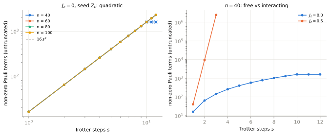
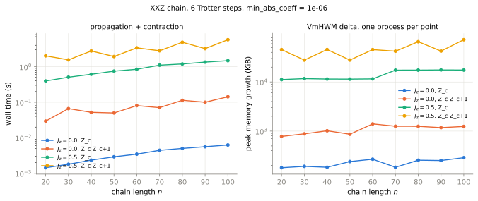
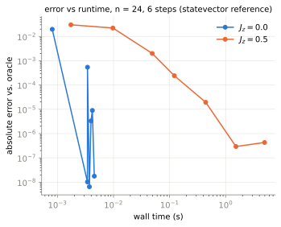
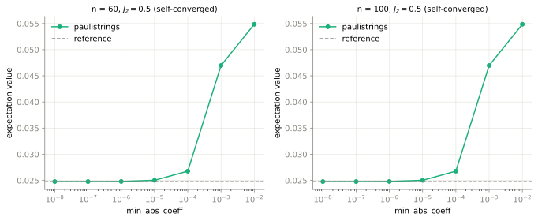

# Benchmark D — 1D Trotterized XXZ chain

Scaling, an analytically-predicted growth law, and a self-check, for the open XXZ chain

    H = sum_{i=0}^{n-2} ( X_i X_{i+1} + Y_i Y_{i+1} + Jz Z_i Z_{i+1} )

first-order-Trotterized at `dt = 0.1` by `examples/common/circuits.py::xxz_chain_trotter` (three
`pauli_rotation` channels per bond, even bonds then odd bonds, **one gate per channel**). Adapted
plan `research/plans/2026-08-31-examples-benchmarks-suite.md` §6 Part A, row **D**.

| | |
|---|---|
| driver | `run_benchmark_d.py` (`growth`, `statevector`, `scaling`, `convergence`, `julia`, `figures`, `all`) |
| results | `results/*.json` — committed, one file per mode, overwritten (not appended) on rerun |
| figures | `figures/*.svg` — regenerable from the committed JSON with `figures` |
| CI gate | `python/paulistrings/tests/test_benchmark_d_xxz.py` (11 tests, ~4 s) |
| host | ccqlin038, Intel Xeon Gold 6244 @ 3.60 GHz, `RAYON_NUM_THREADS=1`, `RUST_LOG` unset |

```bash
RAYON_NUM_THREADS=1 python examples/xxz_chain/run_benchmark_d.py all
```

Two regimes: **`Jz = 0`** (free) and **`Jz = 0.5`** (interacting). Observables: the central
`Z_c` (`c = n//2`, weight 1) and `Z_c Z_{c+1}` (weight 2). Direction is always `"heisenberg"`,
initial state always a **domain wall** `|0…01…1⟩`.

Why a domain wall and not `|0…0⟩` or `|+…+⟩`: `|0…0⟩` is an eigenstate of `H` at every `Jz`, so
every expectation would be a constant and every cross-check vacuous; `|+…+⟩` gives `⟨Z_c⟩ = 0` by
symmetry. The domain wall is the standard melting setup, it is a computational basis state (so
PauliPropagation.jl can contract it too — `benchmarks/julia/README.md` "Known gaps" excludes
non-computational non-uniform states), and `⟨Z_c⟩` starts at exactly `−1` and moves.
`test_domain_wall_state_is_not_an_eigenstate` pins both halves of that.

## 1. The `Jz = 0` growth law: quadratic, and exactly `16 s²`

**Verdict: the quadratic claim is confirmed.** Measured log-log slope of untruncated non-zero
term count against Trotter steps `s`, weight-1 seed, fit over `2 ≤ s ≤ n/4 − 1`:

| n | 40 | 60 | 80 | 100 |
|---|---|---|---|---|
| log-log slope | **2.0000** | **2.0000** | **2.0000** | **2.0000** |

Not approximately: the counts are `16 s²` **exactly**, for every unsaturated point measured, and
independently of `dt` (0.05, 0.1, 0.37 all identical) and of the seed site.

| steps `s` | 1 | 2 | 3 | 4 | 5 | 6 | 7 | 8 | 9 | 10 | 11 | 12 |
|---|---|---|---|---|---|---|---|---|---|---|---|---|
| terms, `n = 100` | 16 | 64 | 144 | 256 | 400 | 576 | 784 | 1024 | 1296 | 1600 | 1936 | 2304 |
| `16 s²` | 16 | 64 | 144 | 256 | 400 | 576 | 784 | 1024 | 1296 | 1600 | 1936 | 2304 |
| terms, `n = 40` | 16 | 64 | 144 | 256 | 400 | 576 | 784 | 1024 | 1296 | 1600 | 1600 | 1600 |

The `n = 40` row is in the table on purpose: past `s = 10` its light cone has reached both chain
ends and the count stops growing. That is the law's boundary of validity, not a failure of it, and
it is why the fit window is `s ≤ n/4 − 1` (one Trotter step's even-then-odd bond sweep moves support
by at most two sites in each direction). `test_growth_law_fit_window_excludes_the_boundary` asserts
that the excluded tail really does break the slope, so the window is a physical statement rather
than a convenient cut.

**Why quadratic.** At `Jz = 0` the XX+YY chain is a free-fermion model. Jordan-Wigner maps it to
hopping Majoranas, and every Trotter gate `exp(−i·dt·X_iX_{i+1})`, `exp(−i·dt·Y_iY_{i+1})` is
Gaussian — its conjugation acts on the Majorana operators `γ_a` linearly,
`γ_a → Σ_b O_{ab} γ_b` with `O` orthogonal. A single-site `Z_c = −i γ_{2c} γ_{2c+1}` is a Majorana
**bilinear**, so it stays a sum of bilinears for all time:

    Z_c(s) = −i Σ_{a,b} O_{2c,a} O_{2c+1,b} γ_a γ_b

and each `γ_a γ_b` is exactly *one* Pauli string (a Jordan-Wigner string with X/Y endpoints). The
number of reachable `(a, b)` is the square of the number of reachable Majorana indices, i.e. (cone
width)², and the cone widens by a fixed number of sites per step — hence `O(s²)`, and with this
Trotter decomposition's cone (4 Majorana indices per step per side) exactly `(4s)² = 16 s²`.

The CI test pins the **slope**, not the counts: the prefactor 16 is a property of the bond-sweep
ordering, not of the engine, and hard-coding it would make an unrelated change to
`xxz_chain_trotter` look like an engine regression.

**Weight-2 seed → quartic.** `Z_c Z_{c+1}` is a Majorana *quartic*, so the same argument gives
`O(s⁴)`; measured counts are exactly `(8s² + 6s − 1)²` (169, 1849, 7921, 22801, 52441, 104329,
187489, 312481), whose fitted log-log slope over `2 ≤ s ≤ 8` is 3.70 — the asymptotic 4 approached
from below, as a quartic-plus-lower-order count must be at these depths.

**`Jz = 0.5` for contrast** (same seed, `n = 40`, untruncated): 40 → 9512 → 2 453 872 terms at
`s = 1, 2, 3`. The interaction breaks the bilinear closure, every even Majorana order is generated,
and the count grows exponentially. `s = 4` was not attempted untruncated. This is the regime
truncation exists for, and the reason D's large-`n` results are truncated + convergence-checked
rather than exact.



## 2. Statevector self-check (`n ≤ 26`)

`examples/common/oracles.py::statevector_expectation` (qiskit Aer, dense) against the engine at
`min_abs_coeff = 1e-12`, for **both** regimes, both observables, `n ∈ {20, 24, 26}` and up to three
Trotter steps — 30 cases.

**All 30 cases agree.** Worst `|Δ|` = **2.2·10⁻¹²**, median `|Δ|` = 2.0·10⁻¹⁵, against a 10⁻⁹ bar.
The two worst cases are the deepest interacting ones (`s = 3`, ~818 000 terms after the 10⁻¹²
cutoff), i.e. the error is the cutoff's, not a convention's; the free-regime shallow cases are at
`0` or 2·10⁻¹⁶.

| n | Jz | observable | steps | statevector | paulistrings | \|Δ\| | terms |
|---|---|---|---|---|---|---|---|
| 20 | 0 | `Z_c` | 3 | −0.417930872482 | −0.417930872482 | 5.6e−17 | 144 |
| 20 | 0.5 | `Z_c` | 3 | −0.432856307369 | −0.432856307369 | 2.2e−12 | 818198 |
| 24 | 0 | `Z_cZ_{c+1}` | 3 | +0.393927398178 | +0.393927398178 | 1.2e−12 | 7247 |
| 24 | 0.5 | `Z_cZ_{c+1}` | 2 | +0.705482003672 | +0.705482003672 | 8.9e−14 | 146747 |
| 26 | 0.5 | `Z_c` | 2 | −0.731233222230 | −0.731233222230 | 2.4e−15 | 9504 |

Full table in `results/statevector.json`. The two omitted case families are cost, not doubt:
`n = 26` with `s = 3`, and `Jz = 0.5` with the weight-2 seed at `s = 3`, which keeps ~4·10⁷
untruncated terms.

> **Measured gotcha, worth knowing before adding any oracle-using timed run.** One
> `statevector_expectation` call takes the process from 32 to 97 threads (Aer's own OpenMP pool),
> and `harness.assert_single_threaded` counts threads *gained since import* — it cannot tell Aer's
> pool from Rayon's, so any `threads=1` run after an Aer call fails the pin assertion. Both
> oracle-using modes here therefore do **every** engine propagation before the first oracle call,
> rather than weakening the assertion to `threads=None`.

## 3. Time and peak memory vs `n`

`SCALING_STEPS = 6` Trotter steps, matched `min_abs_coeff = 1e-6` in both regimes, `n = 20…100`.
**One python subprocess per `(n, Jz, observable)` point**, because `VmHWM` is a process-lifetime
high-water mark: a single process would report every later point's memory as the largest earlier
one's. Each record carries both the raw `VmHWM` and `extra.peak_memory_kb_delta` (growth caused by
that run alone, ~37 MiB of interpreter + numpy baseline excluded); the figure plots the delta.



Warm propagation time (s), one discarded warmup per point:

| n | channels | `Jz=0`, `Z_c` | `Jz=0`, `Z_cZ_{c+1}` | `Jz=0.5`, `Z_c` | `Jz=0.5`, `Z_cZ_{c+1}` |
|---|---|---|---|---|---|
| 20 | 342 | 0.0013 | 0.029 | 0.397 | 2.020 |
| 30 | 522 | 0.0019 | 0.063 | 0.507 | 1.558 |
| 40 | 702 | 0.0023 | 0.052 | 0.613 | 2.771 |
| 50 | 882 | 0.0029 | 0.050 | 0.750 | 1.932 |
| 60 | 1062 | 0.0034 | 0.080 | 0.847 | 3.396 |
| 70 | 1242 | 0.0043 | 0.071 | 1.105 | 2.808 |
| 80 | 1422 | 0.0049 | 0.114 | 1.194 | 4.874 |
| 90 | 1602 | 0.0056 | 0.100 | 1.347 | 3.230 |
| 100 | 1782 | 0.0064 | 0.143 | 1.474 | 5.759 |

Three things the curve says, none of them obvious from the plan:

1. **Term count does not grow with `n` at all** — 257/263 (`Jz=0`, `Z_c`), 7841/6631 (`Jz=0`,
   weight 2), ~206 000 (`Jz=0.5`, `Z_c`), 517 000–822 000 (`Jz=0.5`, weight 2), essentially flat
   from `n = 20` to `n = 100`. At fixed depth the operator's light cone, not the chain, sets the
   size of the tracked set: six Trotter steps reach at most ~25 sites, so every `n ≥ ~30` run is
   the same physics padded with identity.
2. **Time is nevertheless linear in `n`** (`Jz=0.5`, `Z_c`: 0.40 s → 1.47 s for a 5.2× channel
   count), because the circuit has `3(n−1)` channels per step and the engine pays a pass over the
   sum for each one, whether or not that bond intersects the support. Cost here is
   `channels × terms`, and the `n` dependence is entirely the channel count. A support-aware
   channel skip would flatten this curve; nothing in the current engine has one.
3. **The counts alternate along the sweep** (7841 vs 6631; 821 750 vs 517 398) — the seed sits on
   bond `c = n//2`, which is an *even* bond when `n ≡ 0 (mod 4)` (`n = 20, 40, 60, 80, 100`) and an
   *odd* one otherwise (`n = 30, 50, 70, 90`). The even-bonds-then-odd-bonds sweep therefore hits
   the seed in the first half-step in one case and the second in the other, which changes the whole
   truncation schedule. It is a property of the circuit's bond ordering, not noise; the zig-zag in
   the figure is real.

Peak memory tracks the term count and the width monomorphization, and nothing else. For the
`Jz=0.5`, `Z_c` series (~206 000 terms at every `n`): 11.2 MiB of growth for `n ≤ 60`, 17.5 MiB for
`n ≥ 70` — 55 B/term against 87 B/term. That step is the `W = 1 → W = 2` boundary at 64 qubits
(64-bit vs 128-bit symplectic keys: 32 B/term of key becomes 48 B/term), which is exactly where a
bucketed structure-of-arrays layout should show it.

## 4. Convergence panels

Global rule 4 ("every truncated result ships with a convergence panel"). Two kinds:

* **error vs runtime at `n = 24`**, against the exact statevector value — a real error axis.
* **self-convergence at `n = 60` and `n = 100`**, `Jz = 0.5`, where no exact reference exists in
  this repo (the plan's TDVP baseline is optional and the package is absent — named follow-up, not
  silently approximated). The reference line is the tightest point of the sweep itself and is
  labeled `self-converged` in `results/convergence.json`; it is **not** an independent oracle.




`n = 24`, 6 Trotter steps, `Z_c`, statevector reference:

| `min_abs_coeff` | `Jz=0` value | \|err\| | terms | s | `Jz=0.5` value | \|err\| | terms | s |
|---|---|---|---|---|---|---|---|---|
| 1e−2 | +0.1096220619 | 2.0e−2 | 53 | 0.0008 | +0.0548567031 | 3.0e−2 | 156 | 0.0017 |
| 1e−3 | +0.1287940647 | 5.4e−4 | 97 | 0.0034 | +0.0469663613 | 2.2e−2 | 1625 | 0.0097 |
| 1e−4 | +0.1293382772 | 3.3e−6 | 150 | 0.0040 | +0.0267695476 | 2.0e−3 | 9918 | 0.0491 |
| 1e−5 | +0.1293259793 | 9.0e−6 | 205 | 0.0042 | +0.0250209395 | 2.4e−4 | 48599 | 0.1216 |
| 1e−6 | +0.1293349316 | 1.8e−8 | 257 | 0.0045 | +0.0247991871 | 1.9e−5 | 206035 | 0.4409 |
| 1e−7 | +0.1293349390 | 1.0e−8 | 311 | 0.0034 | +0.0247800907 | 2.9e−7 | 776432 | 1.5256 |
| 1e−8 | +0.1293349428 | 6.5e−9 | 365 | 0.0037 | +0.0247793658 | 4.3e−7 | 2661871 | 4.9469 |

Exact reference: `⟨Z_c⟩ = +0.129334949228` (`Jz=0`), `+0.024779796796` (`Jz=0.5`). The free regime
reaches 10⁻⁸ with 365 terms and 4 ms; the interacting regime needs 2.7·10⁶ terms and 5 s to reach
3·10⁻⁷.

Two honesty notes about this table, since neither is what an idealized convergence curve looks
like:

* **The error is not monotone in the cutoff** (`Jz=0`: 3.3e−6 at 1e−4, then 9.0e−6 at 1e−5;
  `Jz=0.5`: 2.9e−7 at 1e−7, then 4.3e−7 at 1e−8). Truncation error has no reason to be monotone —
  dropped terms carry signs and can cancel — so a tighter cutoff can land slightly further from the
  exact value while the *trend* still converges. Nothing here requires monotonicity (that is
  benchmark B's acceptance gate, on a different quantity).
* **The last decade buys nothing measurable.** Below ~3·10⁻⁷ the comparison stops resolving:
  2.7·10⁶ floating-point coefficients summed in an unspecified order, contracted against a dense
  reference with an error budget of its own, is the floor of the *comparison*, not of the
  truncation. Any claim past that would need a reference of stated accuracy, which this one is not.

The self-converged panels at `n = 60` and `n = 100` produce **bit-identical values at every cutoff**
(`+0.0247793658` at 10⁻⁸ for both) and identical term counts, differing only in wall time
(9.6 s vs 16.5 s at 10⁻⁸ — the channel-count effect of §3). That is the cone-limitation of §3 seen
from the other side: at six Trotter steps a 60-site chain and a 100-site chain are the same
calculation, so the `n = 100` "self-converged" answer is corroborated by an `n = 24` run with an
*exact* reference, where the same sweep converges to 4·10⁻⁷ of the statevector value.

## 5. PauliPropagation.jl at matched truncation

Blocking parity gate first (plan §7 rule 2: term-count parity blocks timing), then warm times.
Per-layer term counts are compared **index by index** in gate-application order, reusing
`benchmarks/python/test_julia_parity.py::run_rust`, and the task JSON is built from the *same*
recorded gate list the engine runs, so neither side gets a transcription of the other's circuit.

Cutoffs are **non-dyadic and strictly positive** (`1e-5`, `1e-6`), which avoids both measured
divergences in `benchmarks/julia/README.md`: §P3 (jl keeps `|c| == eps`, this engine drops it) and
§P9 (jl keeps exact zeros). No eps perturbation was needed.

**Parity: 4/4 cases pass**, on 171–702 layers each — every per-layer term count identical
index-by-index, final counts identical, expectations agreeing to ≤ 1.7·10⁻¹⁶ against a 10⁻¹² bar.
Only then were the times below recorded (PauliPropagation.jl 0.8.2, julia 1.12.6, `dict` backend,
`-t1`, warm minimum of 3 repeats; this engine warm after one discarded run).

| n | Jz | steps | `min_abs_coeff` | layers | terms (both) | \|ΔE\| | paulistrings | jl warm | ratio |
|---|---|---|---|---|---|---|---|---|---|
| 40 | 0 | 6 | 1e−6 | 702 | 257 | 8.3e−17 | 0.0076 s | 0.0018 s | **0.24×** |
| 20 | 0.5 | 3 | 1e−5 | 171 | 3 272 | 1.7e−16 | 0.0141 s | 0.0044 s | **0.31×** |
| 40 | 0.5 | 4 | 1e−6 | 468 | 29 745 | 5.6e−17 | 0.0735 s | 0.1068 s | **1.45×** |
| 40 | 0.5 | 6 | 1e−6 | 702 | 206 035 | 6.9e−18 | 0.6158 s | 0.9794 s | **1.59×** |

("ratio" = jl warm / paulistrings; > 1 means this engine is faster.)

**The ranking changes sign with the size of the tracked set**, somewhere between 3·10³ and 3·10⁴
terms. Below the crossover PauliPropagation.jl's hash-map backend is 3–4× faster; above it this
engine is ~1.5× faster and pulling away. The reason is visible in §3: these circuits have
`3(n−1)` channels per Trotter step — 702 channels for the last row — and this engine pays a
bucketed per-layer pass per channel, which is a fixed cost that a 257-term sum cannot amortize. A
single-point comparison would therefore have "shown" either engine winning by 3–4×, which is why
four sizes are reported and the crossover is stated rather than a headline ratio.

Both directions are far outside the ±5–8% single-threaded noise floor
(CLAUDE.md §Performance discipline), so no `ab-compare.sh` protocol is needed for these claims. The
first three rows were measured twice (the last row was added afterwards) and reproduced their
ratios as 0.24/0.28, 0.31/0.32 and 1.45/1.48 — same ranking, same order of magnitude, run-to-run
spread well under the sign changes being reported.

## What is not here

* **TDVP / tensor-network baseline** at large `n` — the plan lists it as optional and no such
  package is a dependency of this repo. The interacting large-`n` numbers are therefore
  self-converged and labeled as such.
* A `pytest-benchmark` entry (as benchmarks A/B/E have). D's deliverable is a *sweep* — 36 scaling
  points plus two truncation grids — and `pytest-benchmark`'s per-point recalibration would rerun
  each point to a target precision for no gain, while the memory curve positively requires one
  process per point. Correctness is gated by the CI test file instead.
